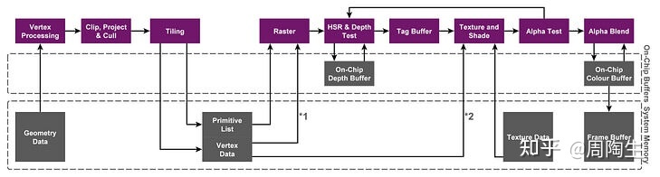

https://www.its203.com/article/qq_36005498/119064606

https://zhuanlan.zhihu.com/p/390625258

https://zhuanlan.zhihu.com/p/531900597

https://ashanpriyadarshana.medium.com/cuda-gpu-memory-architecture-8c3ac644bd64

1. SoC(System on Chip) 把CPU，GPU，内存，通信基带，GPS模块放

   在一起的芯片
3. System Memory:内存。手机上CPU和GPU公用的一片物理内存，一般几个G。

3. On-chip Memory：缓存。CPU和GPU的高速SRAM的Cache缓存，一般几百K到几M，比内存快几倍到几十倍，他们都共享内存地址空间（桌面端是分开的）。在TB(D)R架构下会存储Tile的颜色、深度和模板缓冲
4. PC GPU 架构：
   + SM(Streaming Multiprocessors)：GPU的基本硬件单位。可同时执行多个线程。可包含多个warp
   + warp: GPU物理线程组，一个warp一般有32个线程。一个warp内的线程只能并行的执行一样的指令，但可针对不同数据。SIMD的执行方式
   + block: 与warp不同，可以有任意数量的线程，但只能由一个SM执行

#### IMR (Immediate Mode Rendering)

PC和主机的渲染方式。每一次调用指令，直接绘制对象，同时读写FrameBuffer和depthBuffer。

+ 提供了最大程度的灵活性和控制性
+ 各种着色器数据可以保留在内部芯片上
+ 很少使用外部存储带宽存储检索几何结果
+ 频繁读写buffer，需要大量的带宽，可通过缓存优化。移动端受限于GPU尺寸和功耗要求，不能将cache做大，所以不能用IMR.

### TBR(Tile-Based Rendering)

将帧缓存分割成小块，逐块进行渲染。对frameBuffer的读写在on-chip memory上

+ 对CPU传来的绘制命令，只做顶点数据处理。处理后的顶点数据进行Tiling/Binning Pass，根据每个三角形在frameBuffer的位置找对应的tile，将三角形的指针记录到该tile的PrimitiveList中
+ Rasterization时，对每个tile，从其primitiveList中取出三角形列表，进行光栅化操作
+ 读取发生在需要几何和纹理信息的时候，写会也只发生在绘制完成时，带宽消耗最大的Framebuffer的读写都在on_chip memory上完成。

### TBDR(Tile-Base Deferred Rendering)

在TBR的基础上，通过硬件层面的特性HSR(隐藏面消除)解决overdraw问题。HSR避免了不必要的Fragment shader计算，实现了从光栅化Fragment shader的延迟。HSR (隐藏面消除)是要假设前面的物体会挡住后面的物体的，但当Alpha Test&Alpha Blend存在时，前面的物体并不会挡住后面的物体，这时，不仅没有作用，反而会打断现有的Deferred流程，导致性能降低。

### 总结

TBR的优缺点

优点：

+ 有利于消除overdraw，HSR和 Forward pixel kill能最大限度的降低overdraw
+ 切分tile后，frameBuffer可存储在on-chip memory上，cache friendly, 显著降低带宽和功耗

缺点：

+ binning过程：VS后binning的过程，输出的数据到DDR，又从内存读进来，VS数据过多时，有性能瓶颈
+ 三角形覆盖到多个tile上时，要多次绘制

**需要在与几何相关的额外带宽成本和帧缓冲区数据的带宽节省之间取得平衡**。

### 优化建议：

1. 不使用FrameBuffer时及时Clear或Discard：清空了在tile buffer上的中间数据。Unity中，不使用RT时调用Discard。OpenGL ES中善用glClear、glInvalidateFrameBuffer，避免不必要的Resolve（tile buffer刷新到系统内存）行为
2. 减少一帧中FrameBuffer绑定的频繁切换：减少了tile buffer和系统内存之间的stall操作
3. 考察Alpha Test和Alpha混合的实际表现，合理使用。减少Alpha混合实现透明时的混合范围（例如将透明区域的Mesh裁剪掉替换为多边形）
4. 使用Alpha Test时先进行提前深度测试
5. 图片尽量压缩，例如ASTC ETC2
6. 图片尽量开启mipmap
7. 贴图采样：UV值尽量使用VS中传出的Varying变量（VS向PS中传递的变量）（连续），不要再FS中动态计算UV（非连续），造成CacheMiss
8. 在延迟渲染中尽量利用Tile Buffer
9. 项目配置中不同的配置导致的帧率变化，可能是带宽占用的问题
10. MSAA在TBDR下消耗很小：硬件速度快
11. 减少FS中Clip(HLSL)、discard(GLSL)、gl_FragDepth的使用：会打断Early-DT的执行
12. 区分使用float、half、fix：1). 降低带宽占用 2). 减少GPU周期提高并行程度 3). 降低统一变量寄存器数量，从而降低寄存器数量溢出风险，参考[Unity3D shader优化技巧集合](http://www.xionggf.com/post/unity3d/shader/u3d_shader_optimization/)
13. 减少FrameData压力：顶点处理部分容易成为瓶颈，应避免使用曲面细分shader、置换贴图等负操作。提倡使用模型LOD，且尽早进行遮挡剔除（如umbra）