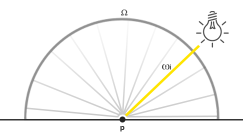

The radiance $L$ measures the radiant flux $\Phi$ or light energy of a light source over a given solid angle $w$. When the solid angle $w$ is infinitely small the radiance measure the flux of a light source over a single light ray or direction vector.



For a point light, all possible incoming light directions over its hemisphere $\Omega$ only one incoming direction vector $w_i$ directly comes from the point light source. The code is:

```c
vec3 lightColor = vec3(23.47, 21.31, 20.79);
vec3 wi = normal(lightPos - fragPos);
float cosTheta = max(dot(N, wi), 0);
float attenuation = calculateAttenuation(fragPos, lightPos);
vec3 radiance = lightColor * attenuation * cosTheta;
```

In case of a direct point light the radiance function $L$ measures the light color, attenuated over its distance to $p$ and scaled by $n\cdot w_i$, but only over the single light ray $w_i$. 

We can directly take the number of light sources and calculate their total irradiance, given that each light source has only a single light direction that influence the surface's radiance. So it is not required to try and solve the integral.

#### A PBR surface model

To satisfy the reflection reflectance equation we loop over each light source, calculate its individual radiance and sum its contribution scaled by the BRDF and light's incident angle.

```c
vec3 Lo = vec3(0.0);
for(int i = 0; i < 4; ++i) 
{
    vec3 L = normalize(lightPositions[i] - WorldPos);
    vec3 H = normalize(V + L);
  
    float distance    = length(lightPositions[i] - WorldPos);
    float attenuation = 1.0 / (distance * distance);
    vec3 radiance     = lightColors[i] * attenuation; 
    [...]  
```

Then, for each light we calculate the full Cook-Torrance specular BRDF term:

```c
vec3 fresnelSchlick(float cosTheta, vec3 F0)
{
	return F0+(1-F0)*pow(1-cosTheta, 5.0);
}
vec3 F0 = vec3(0.04);
F0 = mix(F0, albedo, metallic);
vec3 F = fresnelSchlick(max(dot(h, v), 0), F0);
```

The calculation of D and F is:

```c
float DistributionGGX(vec3 N, vec3 H, float roughtness)
{
	float a = roughtness * roughtness;
    float NdotH = max(dot(N, H), 0);
    float NdotH2 = NdotH * NdotH;
    float denom = (NdotH2 * (a - 1) + 1);
    denom = denom * denom * Pi;
    return a / denom;
}

float GeometrySchlickGGX(float NdotV, float roughtness)
{
    float k = (roughtness + 1) * (roughness + 1) / 8;
    return NdotV / (NdotV * (1-k) + k);
}

float GeometrySmith(vec3 N, vec3 V, vec3 L, float roughness)
{
    float NdotV = max(dot(N, V), 0);
    float NdotL = max(dot(N, L), 0);
    float ggx2 = GeometrySchlickGGX(NdotV, roughness);
    float ggx1 = GeometrySchlickGGX(NdotL, roughtness);
    return ggx1 * ggx2;
}

void main()
{
    ....;
        float NDF = DitributionGGX(N, H, roughtness);
        float G = GeometrySmith(N, V, L, roughtness);
        vec3 numerator = NDF * G * F;
        float demoninator = 4.0 * max(dot(N, V), 0) * max(dot(N, L), 0);
        // in case divide by zero;
        vec3 specular = numerator / max(denominator, 0.001);

        vec3 KS = F;
        vec3 KD = vec3(1.0) - KS;
        KD * = 1.0 - metallic;

        float NdotL = max(dot(N, L), 0.0);
        L0 += (KD * albedo / PI + specular) * radiance * NdotL;
    
    // after calculate
    vec3 ambient = vec3(0.03) * albedo * ao;
    vec3 color = ambient + L0;
    // tone mapping for HDR
    color = color / (color + vec3(1.0));
    // inverse gamma correction
    color = pow(color, vec3(1.0/2.2));
}
```

Because metallic surfaces don't refract light and thus have no diffuse reflections we enforce this property by nullifying KD if the surface is metallic:

```
KD *= 1 - metallic;
```

