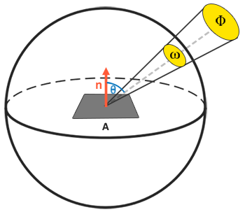

For a PBR lighting model to be considered physically based it has to satisfy the the following conditions:

+ Be based on the microfacet surface model
+ Be energy conserving
+ Use a physically base BRDF

#### The microfacet model


PBR describes that any surface at a microscopic scale can be described by tiny little perfectly reflective mirrors called microfacets. The rougher a surface is, the more chaotically aligned each microfacet will be along the surface.

The effect of these tiny-like mirror alignments is that when specifically talking about specular lighting/reflection the incoming light rays are more likely to scatter along completely different directions on rougher surfaces, resulting in a more widespread specular reflection.

PBR statistically approximate the surface's microfacet roughness given a **roughness** parameter. Based on the roughness of a surface we can calculate the ratio of microfacets roughly aligned to some vector $h$ (the halfway vector.) **The more the microfacets are aligned to the halfway vector, the sharper and stronger the specular reflection**.

#### Energy conservation

The definition of energy conservation: outgoing light energy should never exceed the incoming light energy (excluding emissive surface). For energy conservation, we need to make a clear distinction between diffuse and specular light. The light gets split in both a refraction part and reflection part when hits a surface. The reflection part get reflected and forms specular lighting. The refraction part is the remaining part that enters the surface and get absorbed. Not all energy is absorbed and the light will be scattered in a random direction which is diffuse light.

**Metallic** surfaces react differently to light compared to non-metallic surfaces. Metallic surfaces follow the same principles of reflection and refraction, but all refracted light gets directly absorbed without scattering, leaving only reflected or specular light; metallic surfaces show no diffuse colors.

#### The reflectance equation

$$
L_0(p, w_0) = \int_{\Omega}^{}f_r(p,w_i,w_0)L_i(p,w_i)n\cdot w_idw_i
$$

Radiance, denoted as $L$, is used to quantify the magnitude or strength of light coming from a single direction.

##### Radiant flux

Radiant flux $\Phi$ is the transmitted energy of a light source measured in Watts.

##### Solid angle: 

The solid angle denoted as $w$ tells us the size or area of a shape projected onto a unit sphere.

##### Radiant intensity

Radiant intensity measures the amount of radiant flux per solid angle or the strength of a light source over a projected area onto the unit sphere. The equation is
$$
I = \frac{d\Phi}{dw}
$$
**Radiance** is described as the total observed energy over an area $A$ over the solid angle $w$ of a light of radiant intensity $\Phi$.



$$
L =\frac{d^2\Phi}{dAdwcos\theta}
$$
Radiance is a radiometric measure of the amount of light in an area scaled by the incident angle $\theta$ of the light to the surface normal. If we consider the solid angle $w$ and area to be infinitely small, we can use radiance to measure the flux of a single ray of light hitting a single point in surface. This relation allows us to calculate the radiance of a single light ray influencing a single point. The solid angle $w$ is translated into a direction vector $w$ and A into a point $p$.

When it comes to radiance we generally care about all incoming light onto a point p which is the sum of all radiance known as irradiance.

$$
L_0(p, w_0) = \int_{\Omega}^{}f_r(p,w_i,w_0)L_i(p,w_i)n\cdot w_idw_i
$$
$L$ in the equation represents the radiance of some point $p$ and some incoming infinitely small solid angle $w_i$ which can be thought of as an incoming direction vector $w_i$. The $cos\theta$ here is represented as $n\cdot w_i$. The reflectance equation calculates the sum of reflected radiance $L_o(p, w_o)$ of a point $p$ in the direction $w_o$ which is the outgoing direction to the viewer. $L_o$ measures the reflected sum of the light's irradiance onto point $p$ as view from $w_o$.

As the reflectance equation is based around irradiance which is the sum of all incoming radiance we measure light light of not just a single incoming light direction, but all incoming light directions within a hemisphere $\Omega$ centered around point $p$. 

To calculate the total of values inside an area or, in the case of a hemisphere, a volume we use a mathematical construct called an integral denoted in the reflectance equation as $\int$ over all incoming directions $dw_i$ within the hemisphere $\Omega$. We take the result of small discrete steps of the reflectance equation over the hemisphere $\Omega$ and averaging there their results over the step size. This is **Riemann sum**.

```c
int steps = 100;
float sum = 0.0f;
vec3 P = ...;
vec3 Wo = ...;
vec3 N = ...;

float dw = 1.0f / steps;
for(int i=0;i<steps;++i)
{
    vec3 Wi = getNextIncomingLightDir(i);
    sum += Fr(P, Wi, Wo) * L(P, Wi) * dot(N, Wi) * dw;
}
```

**The reflectance equation sum the radiance of all incoming light directions $w_i$  over the hemisphere scaled by $f_r$ that hits point p and returns the sum of reflected light $L_o$ in the viewer's direction**.

#### BRDF


The BRDF, or bidirectional reflective distribution function, approximates how much each individual light ray $w_i$ contributes to the final reflected light of an opaque surface given its material properties. Although there are several physically base BRDFs, the most commonly used is Cook-Torrance BRDF. The Cook-Torrance BRDF contain both diffuse and specular part:
$$
f_r = k_df_{lambert}+k_sf_{cook-torrance}
$$
$k_d$ is the ratio of incoming light energy get refracted with $k_s$ being the ratio that gets reflected. The diffuse part's function:
$$
f_{lambert} = \frac {c}{\pi}
$$
With $c$ is the albedo or surface color. The divide by pi is to normalize the diffuse light as the earlier denoted integral that contains the BRDF is scaled by $\pi$.


The specular part of the BRDF is:
$$
f_{cook-torrance} = \frac{DFG}{4(w_0 \cdot n)(w_i \cdot n)}
$$


##### Normal distribution function


The normal distribution function D approximates the amount the surface's microfacets are aligned to the halfway vector. The equation used here is Trowbridge-Reitz GGX:
$$
D(n, h, \alpha) = \frac{\alpha ^2}{\pi ((n\cdot h)^2(\alpha ^2-1) + 1)^2}
$$
When the roughness is low a highly concentrated number of microfacet are aligned to halfway vector over a small radius. The NDF displays a very bright spot. The code is:


```c
float DistributionGGX(vec3 N, vec3 H, float a)
{
	float a2 = a*a;
    float NdotH = dot(N, H);
    float NdotH2 = NdotH * NdotH;
    
    float denom = (NdotH2 * (a2-1) + 1);
    demon = PI * demon * demon;
    return a2 / demon;
}
```

##### Geometry function

The geometry function describes the self-shadowing property of microfacets.
$$
G_{SchlickGGX}(n, v, k) = \frac{n\cdot v}{(n\cdot v)(1-k) + k}
$$
$k$ is a remapping of $\alpha$ base on whether we're using the geometry function for direct light or IBL lighting:
$$
k_{direct} = \frac{(\alpha+1)^2}{8}\\
k_{IBL} = \frac{\alpha^2}{2}
$$
To effectively approximate the geometry we need to take account of both the view direction and the light direction vector. The method is **Smith's method**:
$$
G(n, v, l, k) = G_{sub}(n,v,k) * G_{sub}(n,l,k)
$$


```c
float GeometrySchlickGGX(float dotVal, float k)
{
	float denom = dotVal * (1-k)+k;
    return dotVal / denom;
}

float GeometrySmith(vec3 N, vec3 L, vec3 V, float k)
{
    float NdotV = dot(N, V);
    float NDotL = dot(N, L);
    float ggx1 = GeometrySchlickGGX(NdotV, k);
    float ggx2 = GeometrySchlickGGX(NdotL, k);
    return ggx1 * ggx2;
}
```

##### Fresnel equation

The Fresnel equation describes the ratio of light that gets reflect over the light that get refracted, which varies over the angle we're looking at a surface. The moment light hits a surface, based on the surface to view angle the Fresnel equation tells us the percentage of light that get reflected.

Every surface or material has a level of base reflectivity when lookin straight at its surface, but when looking at the surface form an angle all reflections become more apparent compared to the surface's base reflectivity. The phenomenon is described by Fresh equation. An approximation of  it is Fresnel-Schlick:
$$
F_{Schlick}(h, v, F_0) = F_0 + (1-F_0)(1-(h\cdot v))^5
$$
$F_0$ represents the **base reflectivity of the surface**. which is:
$$
(\frac{n_1-n_2}{n_1+n_2})^2
$$
The Fresnel-Schlick approximation is only really defined for dielectric or non-metal surfaces. For metal surfaces calculating the base reflectivity using their indices of refraction doesn't properly hold. To solve this, we further approximate by pre-computing the surface's response at **normal incidence $F_0$** and interpolate this value base on the view angle as per the Fresnel-Schlick approximation such that we can use the same equation for both metals and non-metals.

The specific attributes of metallic surfaces compared to dielectric surface gave rise to something called the metallic workflow where we author surface materials with an extra parameter known as **metalness** that describes whether a surface is either a metallic or a non-metallic surface.

```c
// precomputing F0
vec3 F0 = vec3(0.4);
F0 = mix(F0, surfaceColor.rgb, metalness);
```

Here a base reflectivity of 0.04 holds for most dielectrics and produces physically plausible results without having to author an additional surface parameter. Then, based on how metallic a surface is we either take the dielectric base reflectivity or take $F_0$ authored as the surface color.

The code of Fresnel Schlick approximation is:

```c
vec3 freshelSchlick(float cosTheta, vec3 F0)
{
	return F0 + (1-F0)*pow(1-cosTheta, 5);
}
```

Because the Fresnel term F represents the ratio of light that gets reflected on a surface. This is effectively the ratio $k_s$, meaning the specular part of the reflectance equation implicitly contains the reflectance ratio $k_s$, so the final reflectance equation becomes:
$$
L(p, w_0) = \int_{\Omega}{}(k_d*\frac{c}{\pi} + \frac{DFG}{4(n\cdot w_i)(n\cdot w_0)}) * L(p,w_i)n\cdot w_idw_i
$$

#### Authoring PBR materials

**Albedo**:  The albedo texture specifies for each texel the color of the surface, or the base reflectivity if that texel is metallic. This is similar to what we've been using before as a diffuse texture, but all lighting information is extracted from the texture. It should contain only the color of the surface.

**Normal**: Same as before.

**Metallic**: This specifies per texel whether the texel is metallic or it isn't.

**Roughness**: specifies how rough a surface is on a per texel basis.


#### Fresnel reflection

The fresnel equations describes the reflection and transmission of light when incident on an interface between different optical media. The ratio between incident light and reflected light can be calculated by Fresnel reflection.

#### Schlick's approximation

Schlick's approximation is a formula for approximating the contribution of the Fresnel factor in the specular reflection of light. The equation is:
$$
R(\theta) = R_0 + (1-R_0)(1-\vec v \cdot \vec n)^5\\
R_0 = (\frac{n_1-n_2}{n_1+n_2})^2
$$
$n_1, n_2$ are the indices of refraction of the two media at the interface. In computer graphics, one the the interfaces is usually air, meaning that $n_1$ is 1.

In microfacet model it is assumed that there is always a perfect reflection, but the normal changes according to a certain distribution, resulting in a non-perfect overall reflection. When using Schlick's approximation, the normal in the above computation is replaced by the halfway vector.
