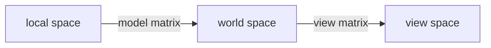
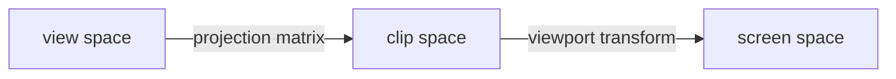

#### Texture

To use texture, each vertex should thus have a texture coordinate associated with them that specifies what part of the texture image to sample from. Retrieving the texture color using texture coordinates is called sampling.

##### Texture Wrapping

When the texture coordinate exceeds (1, 1), there are serval option:

+ **GL_REPEAT**: Repeats the texture image, ignore the integer part
+ **GL_MIRRORED_DEFAULT**: Same as GL_REPEAT but mirrors the image with repeat.
+ **GL_CLAMP_TO_DEDE**: Clamps the coordinates between 0 and 1. The higher coordinates become clamped to the edge, resulting in a stretched edge pattern.
+ **GL_CLAMP_TO_BORDER**: Coordinates outside the range are now  given a user-specified border order.

```
glTexParameteri(GL_TEXTURE_2D, GL_TEXTURE_WRAP_S, GL_MIRRORED_REPEAT)
```

Each of the aforementioned options can be set per coordinate axis(s, t, r). It the **GL_CLAMP_TO_BORDER** option is chosen, we should specify a border color.

```
float borderColor[] = {1.0f, 1.0f, 1.0f, 1.0f};
glTexParamterfv(GL_TEXTURE_2D, GL_TEXTURE_BORDER_COLOR, borderColor);
```

##### Texture Filtering

Texture coordinates do not depend on resolution but can be any floating point value, thus OpenGL has to figure out which texture pixel (texel) to map the texture coordinate to. 

+ **GL_NEAREST (nearest neighbor filtering)**: This is default. OpenGL selects the pixel which center is closest to the texture coordinate.
+ **GL_LINEAR (linear filtering)**: Takes an interpolated value from the texture coordinate's texels, approximating a color between the texels.


Texture filtering can be set for magnifying and minifying operations. For example, we could use nearest neighbor filtering when textures are scaled downwards and linear filtering for upscaled textures.

```c++
glTexParameteri(GL_TEXTURE_2D, GL_TEXTURE_MIN_FILTER, GL_NEAREST);
glTexParameteri(GL_TEXTURE_2D, GL_TEXTURE_MAG_FILTER, GL_LINEAR)
```

##### Mipmaps

When object are far away and probably produce only a few fragments, OpenGL has difficulties retrieving the right color value for its fragment from the high resolution texture, since it has to pick a texture color for a fragment that spans a large part of texture.

Mipmap is basically a collection of texture images where each subsequent texture is twice as small compared to the previous one.  After a certain distance threshold from the viewer, OpenGL will use a different mipmap texture that best suits the distance to the object. It is also filter between mipmap levels using NEAREST and LINERA. The options includes **GL_NEAREST_MIPMAP_NEAREST, GL_LINEAR_MIPMAP_NEAREST, GL_NEAREST_MIPMAP_LINERA, GL_LINEAR_MIPMAP_LINEAR**.

```c++
glTextureParameteri(GL_TEXTURE_2D, GL_TEXTURE_MIN_FILTER GL_LINEAR_MIPMAP_LINEAR)
glTexParameter(GL_TEXTURE_2D, GL_TEXTURE_MAG_FILTER, GL_LINEAR)
```

Since mipmaps are primarily used for when textures get downscaled. Texture magnification doesn't use mipmaps and giving it a mipmap filtering option will generate GL_INVALID_ENUM.

##### Generating a texture

```c++
unsigned int texture;
glGenTextures(1, &texture);
glBindTexture(GL_TEXTURE_2D, texture);
// set the texture wrapping/filtering options (on the currently bound texture object)
glTexParameteri(GL_TEXTURE_2D, GL_TEXTURE_WRAP_S, GL_REPEAT);	
glTexParameteri(GL_TEXTURE_2D, GL_TEXTURE_WRAP_T, GL_REPEAT);
glTexParameteri(GL_TEXTURE_2D, GL_TEXTURE_MIN_FILTER, GL_LINEAR);
glTexParameteri(GL_TEXTURE_2D, GL_TEXTURE_MAG_FILTER, GL_LINEAR);
// load and generate the texture
int width, height, nrChannels;
unsigned char *data = stbi_load("container.jpg", &width, &height, &nrChannels, 0);
if (data)
{
    glTexImage2D(GL_TEXTURE_2D, 0, GL_RGB, width, height, 0, GL_RGB, GL_UNSIGNED_BYTE, data);
    glGenerateMipmap(GL_TEXTURE_2D);
}
else
{
    std::cout << "Failed to load texture" << std::endl;
}
stbi_image_free(data);
```

##### Applying textures

GLSL has a built-in data-type for texture objects called a **sampler** that takes as a postfix the texture type we want e.g. sampler1D, sampler2D. We can add a texture to the fragment shader by simply declaring a uniform sampler2D. Use the glsl's ***texture*** function samples the corresponding color value.

```
out vec4 FragColor;

int vec3 texCoord;
uniform sampler2D texture1;
uniform sampler2D texture2;

void main()
{
	FragColor = mix(texture(texture1, texCoord), texture(texture2, textCoord), 0.2);
	// The mix returns (1-0.2)*first_val + 0.2*second_val, which is lerp
}
```

Using glUniform1i we can assign a location value to the texture sampler so we can set multiple textures at once in a fragment shader. This location of a texture is known as **texture unit**.  When there more than 1 texture, we must active it and then bind it like

```
glActiveTexture(GL_TEXTURE0)
glBindTexture(GL_TEXTURE_2D, texture);
glActvieTexture(GL_TEXTURE1);
glBindTexture(GL_TEXTURE_2D, texture2);

// set image uniform
ourShader.use(); // don't forget to activate the shader before setting uniforms!  
glUniform1i(glGetUniformLocation(ourShader.ID, "texture1"), 0); // set it manually
ourShader.setInt("texture2", 1); // or with shader class
```

Texture unit G_TEXTURE0 is always activated by default, so we can ignore it when there is only one texture.

#### Transformations

##### GLM

GLM stands for OpenGL Mathematics and is a header only library, which means that we only have to include the proper header files and we are done, no linking and compiling necessary.

```
#include <glm/glm.hpp>
#include < glm/gtc/matrix_transform.hpp>
#include < glm/gtc/type_ptr.hpp>

glm::vec4 vec(1.0f, 0.0f, 0.0f, 1.0f);
glm::mat4 trans = glm::mat4(1.0f);   // this creates a identity matrix.
trans = glm::translate(trans, glm::vec3(1.0f, 1.0f, 0.0f));

// for rotate, the second parameter is angel, the third is rotate axis
trans = glm::rotate(trans, glm::radians(90.0f), glm::vec3(0.0,0.0,1.0));
trans = glm::scale(trans, glm::vec3(0.0, 0.5, 0.5));

// use the transform
unsigned in transID = glGetUniformLocation(shderProgram.ID, "transform_name");
glUniformMatrix4fv(transID, 1, GL_FALSE, glm::value_ptr(trans));
```

#### Coordinate Systems

##### Transform  flow





##### View space

The view space is what people refer to as camera of OpenGL (camera space or eye space). It is the space as seen from the camera's point of view.

##### Clip space

At the end of each vertex shader run, OpenGL expects the coordinates to be within a specific range and any coordinate coordinate that falls outside this range is clipped. A projection matrix will creates a viewing box, which is called frustum.  The projection matrix transforms coordinates within this specified range to normalized device coordinates. **Perspective division** is the process that divide the x, y, z components of the position vectors by the vector's homogeneous w component.

+ Orthographic projection: This defines a cube-like frustum box. To create an orthographic projection matrix we make use of GLM's function ***glm::ortho.

  ```
  //        left, right, buttom, top, (near , for plane)
  glm::ortho(0.0f, 800f, 0.0f, 600f, 0.1f, 100f)
  ```

+ Perspective projection: The projection matrix map a given frustum range to clip space, but also manipulates the w value of each vertex coordinate in such a way that the further away a vertex coordinate from the viewer, the higher w component becomes. GLM function is

  ```
  glm::mat4 proj = glm::perspective(glm::radians(45.0f), (float)width/(float)height, 0.1f, 100.0f);
  ```

  The first parameter is field of view (fov).

##### Z-buffer

OpenGL stores all depth information in a z-buffer. The depth is stored within each fragment (as the fragment's z value) and whenever the fragment wants to output its color, OpenGL compares its depth values with the z-buffer to decide to accept or discard the value. This process is called **depth testing**.

Use the ***glEnable*** or ***glDisable*** to enable an attribute.

```
// enable depth test.
glEnable(GL_DEPTH_TEST);

.....
// before each rendering iteration, clear the depth buffer
glClear(GL_COLOR_BUFFER_BIT | GL_DEPTH_BUFFER_BIT)
```

#### Camera

We can use the OpenGL's ***lookAt*** to create a view matrix for camera:

```
glm::mat4 view
//camera postion, camera look target, up vector
view = glm::lookAt(position, target, up_vec);
```

#### Look around

+ **pitch**: Rotate around the x axis
+ **yaw**: Rotate around the y axis
+ roll: Rotate around the z axis

By conduction, we have

```c++
direction.x = cos(glm::radian(pitch)) * cos(glm::radian(yaw));
direction.y = sin(glm::radian(pitch));
direction.z = cos(glm::radian(pitch)) * sin(glm::radian(yaw));
```

##### Mouse input

The yaw and pitch values are obtained from mouse movement where horizontal move affects yaw and vertical move affects the pitch.

+ First tell the GLFW it should hide the cursor and capture it. Capturing a cursor means that once the application has focus the mouse cursor stays within the window. By calling

  ```
  // after set, the mouse won't be visible and shouldn't leave the window.
  glfwSetInputMode(window, GLFW_CURSOR, GLFW_CURSOR_DISCARD);
  ```

+ Set a mouse callback.

  ```
  // mouse movement callback function prototype
  void mouse_callback(GLFWwindow *window, double xpos, double ypos);
  // register callback
  glfwSetCursorPosCallback(window, mouse_callback);
  ```

  Furthermore, we should constraint the pitch value to (-90, 90).

##### Zoom

***Field of view*** defines how much we can see of the scene. When the field of view becomes smaller the scene's projected space gets smaller giving the illusion of zooming in. This affects the projection matrix.

```c++
void scroll_callback(GLFWwindow *window, double xoffset, double yoffset)
{
	if(fov>=1.0f && fov<=45.0f)
		fov -= yoffset;
	if(fov<=1.0f)
		fov = 1.0f;
	if(fov>=45.f)
		fov = 45.0f;
}
// set
glfwSetScrollCallback(window, scroll_callback)
```

