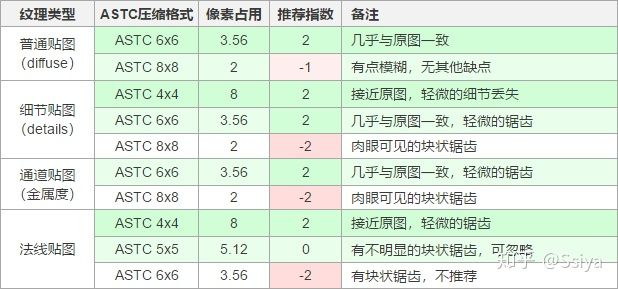
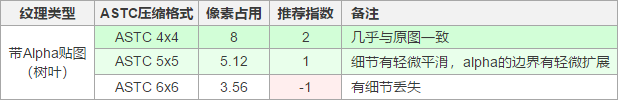

纹理压缩：astc

https://zhuanlan.zhihu.com/p/158740249

1. ASTC支持RGBA，且适用于2的幂次方长宽等比尺寸和无尺寸要求的NPOT(not power of two)纹理。Block size越大，压缩程度越大。

     (1) ios A8之后支持ASTC

     (2) android OpenGL ES3.1之后支持，3.0部分支持 

2. Bits Per Pixel（每像素所占位数）：bpp

3. 压缩结论：无Alpha通道的贴图建议压缩为ASTC 8X8，如果是法线贴图，建议压缩格式为5X5，如有更高要求，可分别设置为6X6，4X4。如下：浅绿色基准推荐，深绿色更高要求推荐

   

5. 带alpha通道，RGBA32位像素压缩比选择：

6. 同一压缩格式下，贴图容量不变，带Alpha通道的贴图压缩质量明显下降。

#### BCn

http://www.reedbeta.com/blog/understanding-bcn-texture-compression-formats/