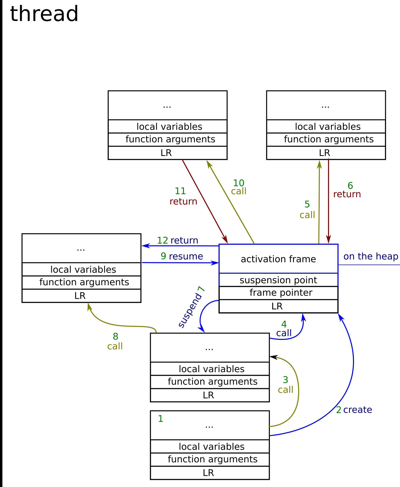

### 								Coroutine Basics

#### Stackful coroutines

Implement as library. Fibers or stackful coroutine are, a separate stack, that can be used to process function calls. Stacks is a contiguous block of memory, that is needed to store the local variable and function arguments. After function call additional information is put on the stack including: 

+ SP - stack pointer. A register that holds the address of the beginning of the stack that belongs to the current function call. Used to refer the arguments and local variables.
+ LR - link register stores the return address (address to the callee)
+ PC - Program counter is the address of currently executed instruction.

When stackful coroutine get executed, the called functions use the previously allocated stack to store its arguments and local variables. Because function calls store all information on the stack for the stackful coroutine, fibre might suspend its execution in any function that gets called in the coroutine. 

In the case of the stackful coroutines, there is no need for a dedicated language feature to use them. Whole stackful coroutines could be just implemented with the help of the library and there are already libraries designed to do this:

- https://swtch.com/libtask/
- https://code.google.com/archive/p/libconcurrency/
- https://www.boost.org Boost.Fiber
- https://www.boost.org Boost.Coroutine 

#### Stackless coroutines

+ Coroutines are strongly connected to the callers - call to the coroutine transfers execution to the coroutine and yielding from the coroutine comes back to its caller.
+ Stackful coroutine lives as long as their stack. Stackless coroutines live as long as their object.

The stackless coroutine are far less memory consuming cause there is no need to allocate the whole stack. Stackless coroutine attributes includes

+ **The stackless coroutines can only suspend themselves only from the top-level function.**
+ All function called from the coroutine must finish before suspending the coroutine for all other functions their data is allocated on the callee stack.
+  the data needed for execution **stored on the caller's stack**. All the data that coroutine needs to preserve its state is allocated dynamically on the heap, which is far smaller in size that the whole stack.



​					Examples of coroutine execution. 

All the function and coroutine calls happen in the same way, in the case of coroutine, however, some additional data needs to be preserved across the calls to known how to jump to the suspension point and restore the state of the local variables. Besides, there is no difference between the function frame and coroutine frame.

The reason why coroutines need to have a dedicated language feature is that the compiler needs to decide, which variables describe the state of the coroutine and create boilerplate code for jumps to the suspension points.

##### Coroutine use cases

Coroutine will simplify writing:

+ generators
+ asynchronous I/O code
+ lazy computations
+ even driven applications


###  						Coroutine implementation

Whether a function is a coroutine or not depends on its body. The co-routine, as they are going to get into the c++20, define three new keywords: **co_await, co_return, co_yield**. If any of those keywords occurs in the function, then it becomes a coroutine.

```c++
#include <experimental/coroutine>

void foo()
{
    std::cout<<"Hello "<<std::endl;
    co_await std::experimental::suspend_always();
    std::cout<<"World";
}
```

The operator co_await is a unary operator, which takes the Awaitable object as its argument. The suspend_always is the Awaitable object, and calling co_await on it will result in suspending the coroutine.

##### Communicate object

The object used to communicate with the coroutine is the object of the coroutine's return type. Its resume method will resume the coroutine if it hasn't finished yet its execution. The creation of this object happens under the hood. The compiler generates some additional code for the coroutines. Every coroutine function is transformed by the compiler to the form similar to this:

```c++
Promise promise;
co_await promise.initial_suspend();
try{
    // co-routine body
}
catch(...){
    promise.unhandled_exception();
}
final_suspend:
	co_await promise.final_suspend();

// the resumable object will be created before the initial_suspend through a call to the:
promise.get_return_object()
```

So we need to create the Promise type.

+ create **promise_type** as a member of the resuable type.
+ specialize **coroutine_traits\<resubale> type and define promise_type in it**.
+ have an additional member function defined **return_void** to handle situations that coroutine reaches the function end.

#### The coroutine_handle

The coroutine_handle is an object, that refers to the coroutine's dynamically allocated state. Through coroutine handle, you can resume the coroutine. code of coroutine handle is:

```c++
template <typename Promise = void>
struct coroutine_handle;

template <typename Promise>
struct coroutine_handle : coroutine_handle<> {
  using coroutine_handle<>::coroutine_handle;
  static coroutine_handle from_promise(Promise&);
  coroutine_handle& operator=(nullptr_t) noexcept;
  constexpr static coroutine_handle from_address(void* addr);
  Promise& promise() const;
}

template <> struct coroutine_handle<void>{
  constexpr coroutine_handle() noexcept;
  constexpr coroutine_handle(nullptr_t) noexcept;
  coroutine_handle& operator=(nullptr_t) noexcept;
  constexpr void* address() const noexcept;
  constexpr static coroutine_handle from_address(void* addr);
  constexpr explicit operator bool() const noexcept;
  bool done() const;
  void operator()();
  void resume();
  void destroy();
private:
  void* ptr;// exposition only
};
```


##### Coroutine_handle emptiness

The coroutine_handle is default constructible. The effect of the parameterless constructor call is the same as calling the constructor with the nullptr_t parameter. When such constructor is invoked, the coroutine_handle will be empty. Its emptiness can be checked with the operator bool or comparison of the result of the address member function with nullptr literal.

##### Valid coroutine_handle

Its static member function **from_address** can be used to create non-empty coroutine. Once the coroutine is created we can use **bool operator** and **address** member function to check its validity.

##### Coroutine resumption

+ Call the **resume** member function of the coroutine_handle
+ Via the call to the **function call operator** of the same object.

##### Coroutine destruction

Coroutine destruction happens whichever of the following events occurs first.

+ Call to the destroy member function of the coroutine_handle type.
+ The execution flow goes off the coroutine function. (after the final suspend point.

Checking the state of the execution

If the coroutine is suspended at its final suspend point, the method **done** returns true.

##### Coroutine_handle and Promise type

Coroutine handle specializations make it possible to create coroutine_handle from the promise object and allow to get the promise object of a coroutine 

#### Implementing promise_type

```c++
class resumable {
public:
  struct promise_type;
  using coro_handle = std::experimental::coroutine_handle<promise_type>;

  resumable(coro_handle handle) : handle_(handle) { assert(handle); }
    
  // not allowing copy and move constructor
  resumable(resumable&) = delete;
  resumable(resumable&&) = delete;

  bool resume() {
    if (not handle_.done())
      handle_.resume();
    return not handle_.done();
  }
  ~resumable() { handle_.destroy(); }
private:
  coro_handle handle_;
};
```

The coroutine_handle is not thread-safe.

##### Definition of promise_type

```c++
struct resumebale::promise_type
{
    using coro_handle = std::experimental::coroutine::coroutine_handle<promise_type>;
    
    // called to create the resumeable type.
    auto get_return_object()
    {
        return coro_handle::from_promise(this);
    }
    
    auto initial_suspend()
    {
        return std::experimental::suspend_always();
    }
    
    auto final_suspend()
    {
        return std::experimental::suspend_always();
    }
    
    void unhandled_exception()
    {
    }
    
    void return_void(){}
}

```

+ First the **get_return_object** is called to create the resemable type. The resumable type needs the coroutine_handle which can be created from the *this promise object.
+ Right after this, the **initial_suspend** member function will be called. This will result in a fact that we will need to call resume for the coroutine to start its execution.
+ The **unhandled_exception** must be defined.
+ The **final_suspend**, in our case, must return always suspend since only then the done method of coroutine_handle will work adequately.
+ In the case of coroutines which never end, neither **return_void** nor **return_value** need to be defined. If the coroutine eventually runs till the end of its body, and if there were no return_void, undefined behavior will appear. If coroutine return some values via **co_return**, the **return_value** function needs to be defined instead of **return_void**.

##### Use of coroutine

```c++
int main()
{
	resemable res = foo();
    while(res.resume());
}
```

#### Deeper into promise type

##### Memory allocation:

get_return_object_on_allocation_failure.

##### Handling co_return

Coroutine can eventually return some value. This is done by **co_return** keyword.  if use co_return without any expression on its right side, the **return_void** will be invoked. If with expression, the **return_value** will be called, so the promise_type should define a **return_value** function. After the co_return, the coroutine is done. The code is: (not successfully examined)

```c++
resumable foo(){
  std::cout << "Hello" << std::endl;
  co_await std::experimental::suspend_always();
  co_return "Coroutine";
}

class resumable{
  // ...
  const char* return_val();
  // ...
};

const char* resumable::return_val(){
  return handle_.promise().string_;
}

int main(){
  resumable res = foo();
  while(res.resume());
  std::cout << res.return_val() << std::endl;
}
```

It is crucial in such cases remember to suspend and not finish the coroutine till the end of the resumable object.

##### co_yield operator

 co_yield can return some value from the coroutine, **but without finishing it**. Fittable to implement generator. When compiler meets the co_yield keyword, it generates:

``` c++
co_await promise.yield_value(expression)
```

We need to implement the **yield_value** function for the promise type. Also note that **no co_await keyword appears**.

The full coroutine implement code is:

```c++
#pragma once
#include<iostream>
#include<string>
#include<experimental/coroutine>

class resumable {
public:
	struct promise_type {
		using coro_handle = std::experimental::coroutine_handle<promise_type>;
		auto get_return_object() {
			return coro_handle::from_promise(*this);
		}
		auto initial_suspend() { return std::experimental::suspend_always(); }
		auto final_suspend() { return std::experimental::suspend_always(); }
		void return_value(const char* data)
		{
			data_ = data;
		}
		// for co_yield;
		std::experimental::suspend_always yield_value(int val)
		{
			val_ = val;
			return std::experimental::suspend_always();
		}

		void unhandled_exception() {
			std::terminate();
		}
		const char* data_;
		int val_;
	};

	using coro_handle = std::experimental::coroutine_handle<promise_type>;

	resumable(coro_handle handle) : handle_(handle) { }
	resumable(resumable&) = delete;
	resumable(resumable&&) = delete;

	bool resume() {
		if (not handle_.done())
			handle_.resume();
		return not handle_.done();
	}

	const char* return_value()
	{
		return handle_.promise().data_;
	}

	int recent_value()
	{
		return handle_.promise().val_;
	}

	~resumable() { handle_.destroy(); }
private:
	coro_handle handle_;
};


resumable foo()
{
	std::cout << "Hello\n";
	co_yield 1;
	co_yield 2;
	co_return "lsw";
}

int main()
{
	resumable a = foo();
	
	a.resume();
	std::cout << a.recent_value() << "\n";
	a.resume();
	std::cout << a.recent_value() << "\n";
	a.resume();
	std::cout << a.return_value() << std::endl;
}

```


### 			Awaitable and Awaiter

#### co_await operator and Awaiter

The co_await operator is actually responsible for two things:

+ Forcing compiler to generate some coroutine boilerplate code
+ Creating the Awaiter object

The co_await operator declaration is looked upon in the awaitable object and if it found this operator is executed to obtain awaitable object. Otherwise, if the appropriate function is not found, then awaitable becomes awaiter.

The code generated by compiler when met co_await operator:

```c++
std::exception_ptr exception = nullptr;
if (not a.await_ready()) {
  suspend_coroutine();

  //if await_suspend returns void
  try {
    a.await_suspend(coroutine_handle);
    return_to_the_caller();
  } catch (...) {
    exception = std::current_exception();
    goto resume_point;
  }
  //endif


  //if await_suspend returns bool
  bool await_suspend_result;
  try {
    await_suspend_result = a.await_suspend(coroutine_handle);
  } catch (...) {
    exception = std::current_exception();
    goto resume_point;
  }
  if (not await_suspend_result)
    goto resume_point;
  return_to_the_caller();
  //endif

  //if await_suspend returns another coroutine_handle
  decltype(a.await_suspend(std::declval<coro_handle_t>())) another_coro_handle;
  try {
    another_coro_handle = a.await_suspend(coroutine_handle);
  } catch (...) {
    exception = std::current_exception();
    goto resume_point;
  }
  another_coro_handle.resume();
  return_to_the_caller();
  //endif
}

resume_point:
if(exception)
  std::rethrow_exception(exception);
"return" a.await_resume();
```

##### Coroutine suspension

After await_ready expression the coroutine is suspended. It doesn't mean that control flow returns to the caller. It means that the needed local data is saved to be restored when coroutine is suspend. When resume the coroutine, resumption point is the **resume_point**.

##### await_suspend expression

```c++
a.await_suspend(coroutine_handle)
```

the await_suspend can return void, bool by value, coroutine handle by value. **The await_suspend exists to decide where the control flow should go after the coroutine is suspended**.

+ return void: the coroutine remains suspended and the control flow is returned to the caller or the resumer of the coroutine
+ return bool value:
  + true: same as return void
  + false: the coroutine immediately resumed (goto resume point) and control flow is not returned to the caller.

+ return coroutine handle: give control flow to a different coroutine. If switched to another coroutine, returning **std::noop_coroutine_handle** to return to the caller. If want to return to the fore coroutine resume_point，you can returning the handle to that coroutine.

##### exceptions

+ thrown from await_suspend: the exception is caught and saved, coroutine gets resumed and the exception is immediately rethrown.
+ thrown from await_ready or await_resume: the functions are called as part of the active coroutine so the excetption would be thrown as in any other function called inside the coroutine.
  + await_ready: the coroutine is not suspended at all. await_suspend and await resume will not be evaluated.
  + await_resume: await_ready and await_suspend is evaluated and all the consequence of value would be evaluated.

##### custom co_await operator

The value returned from co_await expression is the result of the await_resume function. To customize the creation of the Awaiter, we can 

+ custom await_transform function in the promise_type.
+ custom co_await operator in the Awaitable type.

Custom co_await operator will only modify the way awaiter object is obtained.

+ co_await operator is defined inside the awaitable

  ```c++
  Awaiter&& a = awaitable.operator co_await();
  ```

+ no operator co_await is defined the freestanding that take the awaitable as argument is called.

  ```c++
  Awaiter&& a = operator co_await(awaitable);
  ```

+ if no applicable co_await operator found, the awaitable object becomes awaiter object.

  ```c++
  auto && awaiter = awaitable.
  ```


### 				Operator co_await


The coroutines defines two kinds of interfaces:

+ The **Promise** interface specifies methods for customizing the behavior of the coroutine itself. For example, what happens when the coroutine returns and customize the behavior of any co_await and co_yield expression within the coroutine.
+ The **Awaitable** interface specifies methods that control the semantics of a co_await expression. When a value is co_await ed, the code is translated into a series of calls to methods on the awaitable object that allow it to specify: wither to suspend the coroutine(awiat_ready), execute some logic after it has suspended to schedule the coroutine for later resumption (await_suspend) , and so on.

####  Awaitables and Awaiters

**A type that supports the co_await operator is called an Awaitable type**. The promise type used for a coroutine can alter the meaning of a co_await expression within the coroutine  via its await_transform method.

+ **Normally Awaitable**: a type that supports the co_await operator whose promise type does not have an await_tranform
+ **Contextually Awaitable** : promise have await_transform

**Awaiter** type is a type that implements the three special methods that called as part of a co_await expression: await_ready, await_suspend, await_resume.

A type can be both an Awaitable type and An Awaiter type.

#### compiler operation for co_await\<expr>

##### Obtaining the Awaiter

1. Get the Awaitable: 
   + If the promise type P, has a member  name await_transform, then \<expr> is first passed into  a call to promise.await_transform(\<expr>) to obtain the Awaitable value.
   + Otherwise, if the promise type does not have an await_transform member then we use the result of evaluating \<expr> as the Awaiable object.

2. Get the Awaiter object:
   + if the Awaitable object, has an applicable operator co_await() overload then this is called to obtain the Awaiter object.
   + otherwise, the Awaitable object is used as the awaiter object.

##### Awaiting the Awaiter

```c++
{
  auto&& value = <expr>;
  auto&& awaitable = get_awaitable(promise, static_cast<decltype(value)>(value));
  auto&& awaiter = get_awaiter(static_cast<decltype(awaitable)>(awaitable));
  if (!awaiter.await_ready())
  {
    using handle_t = std::experimental::coroutine_handle<P>;

    using await_suspend_result_t =
      decltype(awaiter.await_suspend(handle_t::from_promise(p)));

    <suspend-coroutine>

    if constexpr (std::is_void_v<await_suspend_result_t>)
    {
      awaiter.await_suspend(handle_t::from_promise(p));
      <return-to-caller-or-resumer>
    }
    else
    {
      static_assert(
         std::is_same_v<await_suspend_result_t, bool>,
         "await_suspend() must return 'void' or 'bool'.");

      if (awaiter.await_suspend(handle_t::from_promise(p)))
      {
        <return-to-caller-or-resumer>
      }
    }

    <resume-point>
  }

  return awaiter.await_resume();
}
```

+ the void or true return value of the await_suspend transfers execution back to the caller of the coroutine.
+ When the suspended coroutine is eventually resumed then the execution resumes at the \<resume_point> immediately before the await_resume method is called. The return value of the await_resume method call becomes the result of the co_await.

#### Coroutine Handles

The coroutine_handle represents a non-owning handle to the coroutine frame and can be used to resume execution of the coroutine or to destroy the coroutine frame. Also be used to access the coroutine's promise object. The definition of coroutine is:

```c++
namespace std::experimental
{
  template<typename Promise>
  struct coroutine_handle;

  template<>
  struct coroutine_handle<void>
  {
    bool done() const;

    void resume();
    void destroy();

    void* address() const;
    static coroutine_handle from_address(void* address);
  };

  template<typename Promise>
  struct coroutine_handle : coroutine_handle<void>
  {
    Promise& promise() const;
    static coroutine_handle from_promise(Promise& promise);

    static coroutine_handle from_address(void* address);
  };
}
```

+ Calling .resume() on a coroutine_handle reactivates a suspended coroutine at the \<resume-pioint>
+ The promise() methods returns a reference to the coroutine's promise object. Consider the coroutine's promise object as an internal implementation detail of the coroutine.
+ The courouine_handle\<P>::from_promise(P& promise) function allows reconstructing the coroutine handle from a reference to the coroutine's promise object.
+ The .address() / from_address() allows converting a coroutine handle to/ from a void* pointer.

#### Synchronization-free async coode

co_await operator has the ability to **execute code after the coroutine has been suspended** but before execution is returned to the caller/ resumer by await_suspend function of the awaiter object. This allows an Awaiter object to initiate an async operation after the coroutine is already suspended, **passing the coroutine handle of the suspended coroutine to the operation which it can safely resume when the operation completes without any additional synchronization required.** One example is:

```
Time     Thread 1                           Thread 2
  |      --------                           --------
  |      ....                               Call OS - Wait for I/O event
  |      Call await_ready()                    |
  |      <supend-point>                        |
  |      Call await_suspend(handle)            |
  |        Store handle in operation           |
  V        Start AsyncFileRead ---+            V
                                  +----->   <AsyncFileRead Completion Event>
                                            Load coroutine_handle from operation
                                            Call handle.resume()
                                              <resume-point>
                                              Call to await_resume()
                                              execution continues....
           Call to AsyncFileRead returns
         Call to await_suspend() returns
         <return-to-caller/resumer>
```

As soon as you have started the operation which publishes the coroutine handle to other threads then another thread may resume the coroutine on another thread before await_suspend returns and may continue executing concurrently with the rest of the await_suspend method

When coroutine resumes, the first thing it do is call await_resume() to get the result and then often it will immediately destruct the Awaiter object. The coroutine could potentially run to completion, destruct the coroutine and promise object, all before await_suspend returns. **Avoid accessing this or the coroutine's.promise method object because both could already destroyed.**


## 								Promise type

#### Promise objects

The Promise objects defines and controls the behavior of the coroutine itself by implementing methods that are called at specific points during execution of coroutine. Think about the coroutine's promise object as being a "coroutine state controller" object that controls the behavior of the coroutine and can be used to track its state.

An instance of the promise object is constructed within the coroutine frame for each invocation of a coroutine function. The compiler generates calls to certain methods on the promise object at key points during execution of the coroutine. The code is

```c++
{
    co_await promise.initial_suspend();
    try{
        <body-statements>  // coroutine function body.
    }
    catch(...)
    {
        promise.unhandled_exception();
    }
    FinalSuspend:
    	co_await promise.final_suspend()
}
```

When a coroutine function is called, steps are:

1. Allocate a coroutine frame using operator new (optional).
2. Copy any function parameters to the coroutine frame.
3. Call the constructor for the promise object type, P.
4. Call the **promise.get_return_object()** method to obtain the result to return to the caller when the coroutine first suspends. Save the result as local variable.
5. Call the promise.initial_suspend() method and co_await the result.
6. When the co_await.initial_suspend() expression resumes, then the coroutine starts executing the coroutine body statements that you wrote.

Additional steps executed when reaches a **co_return** statement:

1. Call promise.return_void() or promise.return_value(\<expr>)
2. Destroy all variables with automatic storage duration in reverse order they were created.
3. Call promise.final_suspend() and co_await the result.

Destroying the coroutine frame involves:

1. Call the destructor of the promise object.
2. Call the destructor of the function parameter copies.
3. Call operator delete to free the memory used by the coroutine frame.
4. Transfer execution back to the caller/ resumer.

#### Customizing coroutine frame memory allocation

Extra work is needed to make a copy of the allocator inside the allocated memory so you can reference it in the corresponding call to operator delete since the parameters are not passed to the corresponding operator delete call. **This is because the parameters are stored in the coroutine frame and so they will have already be destructed by the time that operator delete is called.**

```c++
template<typename ALLOCATOR>
struct my_promise_type
{
    // customize the operator new
    template<typename... ARGS>
    void* operator new(std::size_t sz, std::allocator_arg_t, ALLOCATOR& allocator, Args&... args)
    {
        // round up sz to next multiple of ALLOCATOR alignment.
        std::size_t allocatorOffset = (sz + alignof(ALLOCATOR) - 1u) & ~(alignof(ALLOCATOR) - 1u);
        // allcoate space for coroutien frame
        void* ptr = allocator.allocator(allocatorOffset + sizeof(ALLOCATOR));
        
        // take a copy of the allocator
        new(((char*)ptr) + allocatorOffset) ALLOCATOR(allocator);
        return ptr;
    }
    
    void operator delete(void* ptr, std::size_t sz)
    {
        std::size_t allocatorOffset = (sz + alignof(ALLOCATOR) - 1u) & ~(alignof(ALLOCATOR) - 1u);
        ALLOCATOR& allocator = *reinterpret_cast<ALLOCATOR*>((char*)ptr + allocatorOffset);
        
        // move allocator to local variable first so it isn't freeing its own memory from undernneath itself
        ALLOCATOR allocatorCopy = std::move(allocator);
        
        // but don't forget to destruct allocator object in coroutine frame
        allocator.~ALLOCATOR();
        allocatorCopy.deallocate(ptr, allocatorOffset + sizeof(ALLOCATOR)); 
    }
}
```

#### Copying parameters to the coroutine frame

The coroutine needs to copy any parameters passed to the coroutine function by the original caller into the coroutine frame so that they remain valid after the coroutine is suspended.

+ pass by value: parameters are copied to the coroutine frame by calling the type's move-constructor
+ pass by reference: only references are copied into the coroutine frame, not the values they point to.

If any of the parameter copy/move constructor throws an exception then any parameters already constructed are destructed, the coroutine frame is freed and the exception propagates back to the caller.

#### Constructing the promise object.

+ The constructor that accept lvalue reference to each of the copied parameters is called if there is one.
+ If don't, call the default constructor.

#### Obtaining the return object

The control flow can be something like:

```c++
struct coroutine_frame { ... };

T some_coroutine(P param)
{
  auto* f = new coroutine_frame(std::forward<P>(param));

  auto returnObject = f->promise.get_return_object();

  // Start execution of the coroutine body by resuming it.
  // This call will return when the coroutine gets to the first
  // suspend-point or when the coroutine runs to completion.
  coroutine_handle<decltype(f->promise)>::from_promise(f->promise).resume();

  // Then the return object is returned to the caller.
  return returnObject;
}
```

#### The initial-suspend point

The statement **co_await promise.intial_suspend()** is executed after coroutine frame has been initialized and the return object has been obtained.

This allows the author of the promise_type to **control whether the coroutine should suspend before executing the coroutine body that appears in the source code or start executing the coroutine body immediately**.

#### Returning to the caller

When coroutine function reaches its first \<return-to-caller-or-resumer> point (or runs to completion), then the return-object returned from the get_return_object() call is returned to the caller of the coroutine.

**Note that the type of the return-object doesn't need to be the same type as the return-type of the coroutine function. An implicit conversion from the return-object to the return-type of the coroutine is performed if necessary.**

#### Returning from the coroutine using co_return

When reaches a co_return statement, it is translated into either a call to promise.return_void() or promise.return_value(\<expr>) followed by a goto FinalSuspend.

goto FinalSuspend causes all local variables with automatic storage duration to be destructed. Then evaluating co_await promise.final_suspend().

#### Handling exceptions that propagate out of the coroutine body

Exception propagates out of the coroutine body is caught and the promise.unhandled_exception() is called. Call the std::current_exception() to capture a copy of the exception and propose it.

#### The final-suspend point

The execution of  promise.final_suspend allows the coroutine to execute some logic, such as publishing a result, signalling completion or resuming a continuation. Also suspend the coroutine before it is destroyed.

#### How the compiler chooses the promise type

The type of the promise object is determined from the signature of the coroutine by using the **std::experimental::coroutine_traits** class. **The default definition of coroutine_traits template defines the promise_type by looking for a nested promise_type.**

+ For coroutine return-types that you have control over, just define a nested promise_type in the class.

+ For coroutine return-types that don't have control, specialize the coroutine_traits to define the promise type to use without without modifying the type.

  ```c++
  template<typename T, typename... Args>
  struct coroutine_traits<std::optional<T>, Args...>
  {
      using promise_type = optional_promise<T>;
  }
  ```

#### Identifying a specific coroutine activation frame

The coroutine handle is used to identify or refer to a particular coroutine frame. Ways to obtain the coroutine handle:

1. It is passed to the await_suspend() method during a co_await expression
2. If you have a reference to the coroutine's promise object, you can reconstruct its coroutine_handle using coroutine_handle\<Promise>::from_promise()

The coroutine_handle is not an RAII object. Generally use a higher level types that provide RAII semantics for coroutines 

**RAII is Resource Acquisition is Initialization.** 

#### Customizing the behavior of co_await

If the promise type have await_transform defined, the compiler will transform every co_await\<expr>  into promise.await_transform(\<expr>).

not completed.

#### Customizing the behavior of co_yield

The co_yield keyword is translated into co_await promise.yield_value(\<expr>). Customize the behavior of the co_yield by defining yield_value methods