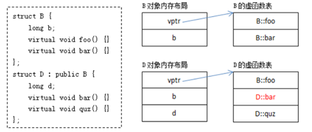
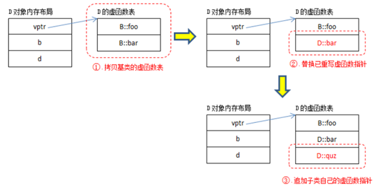

### new, operator new, placement new（delete同理）

new operator

+ 调用operator new分配足够的空间，并调用对象的构造函数
+ 不可重载

operator new：

+ 只分配空间，不会调用对象构造函数。
+ 可重载，返回类型必须声明为 void*，第一个参数为分配空间大小，可带其他参数

placement new:

是operator new的一个标准，全局版本，不能被替换，形式为：

```c++
void *operator new(size_t, void*p)throw(){return p;}
```

改函数忽略size_t参数，返回第二个参数，允许把对象放到特定的地方，达到调用构造函数的效果。不使用时需要调用对象的析构函数。使用步骤

1. 在栈上或堆上提前分配缓存
2. 分配对象： Task *ptask = new（buffer）Task；
3. 使用，使用完成后调用对象的析构函数

### 函数指针:

#### 函数指针变量

返回类型（*函数指针变量）（参数列表）

```c++
int Sum(int a, int b)
{	
	return a+b;
}

int (*FnName)(int,int);      //声明一个函数指针，Fname是一个指向函数的变量
FnName = &Sum;				// 赋值
(*Faname)(3, 5);			//调用
```

#### 函数指针类型

使用typedef定义

```c++
typedef int (*FnType)(int, int);  	// 声明函数指针类型
FnType fb = &Sum;					//定义函数指针变量
(*fb)(3,5);							//调用函数
```

应用代码：

```c++
int Sum(int a, int b)
{
    return a + b;
}

typedef int (*FnType)(int, int);

int Fun1(FnType ft, int x, int y)
{
    return (*ft)(x, y);
}

int Fun2(int (*fn)(int a, int b), int x, int y)
{
    return (*fn)(x, y);
}


```

#### 指向类成员函数的指针

格式: **returnType className::*funPtr(parametrs)**。调用的时候需要 **obj.\*funcP()** 或者 **objPtr->*funcP()**.

```c++
class Num
{
public:
    Num(){n_=0;}
    void Inc(int n);
    void Dec(int n);
    static int Sub(int a, int b);
private:
    long n_;
}

int main()
{
    Num obj;
    void (Num::*mf)(int);
    mf = &Num::Inc;
    (obj.*mf)(10);
    
    //函数指针类型
    typedef void(Num::*mfType)(int);
    mfType fn = &Num::Dec;
    (obj.*fn)(2);
    
    //static function
    int (*smf)(int a, int b);  //声明和普通函数相同
    smf = &Num::Sub;			// 赋值加上类名
    (*smf)(10, 20)				// 调用也和普通函数一样
}

//虚函数

class Base{
public:
  virtual void F() const
  {
    cout << "I am the Base\n";
  }
 
  typedef void (Base::*FnPtr)() const;
};
 
class Derived : public Base{
public:
  virtual void F() const
  {
    cout << "I am the Derived\n";
  }
};
 
int main()
{
  Base::FnPtr fp = &Base::F;
  Base base;
  (base.*fp)();   // 调用基类的函数
  Derived derived;
  (derived.*fp)();	// 调用派生类的函数
 
  return 0;
}
```

### 声明与定义

+ 声明：声明引入一个标识符。告诉编译器存在一个变量或者函数叫这个名称，定义在其他地方。
+ 定义：告诉编译器创建一个函数或变量，分配存储空间。定义的同时也完成了声明。

##### 区别

+ 函数：有函数体为定义，没有为声明。extern可忽略

+ 变量：**纯粹的声明必须用extern关键字且不能初始化，** 如（extern int x)。如果初始化了这个变量，会被认为是一个定义并分配存储空间。

  ```c++
  extern int a; // declaration
  extern int b = 10; // definition
  int c;			// definition.
  ```

头文件避免定义，尽量只包含声明。如果头文件有定义，头文件被多次引用后，会有重复定义的错误。头文件只能在整个项目中引用一次，失去了定义头文件的意义。

### 初始化：

```c++
class CTypeInit{
private:
    // 普通类型，通过初始化列表或者构造函数初始化
    int m_a; 
    
    //引用，只能通过初始化列表初始化
    int &m_ra;
	
    // 静态变量，只能类外初始化，类外去掉static关键字
    static int m_b;
    
    //常量：只能通过列表初始化
    const int m_c;
    
    // 静态常量：类外初始化，不带static，能否类内初始化取决于编译器。
    static const int m_d;
    static const float m_e;
}

int CTypeInit::m_b = 6;
const int CTypeInit::m_d = 6;
const double CTypeInit::m_e = 3.14;
```

c++中，全局变量，文件域的静态变量和类的静态成员在main执行之前的静态初始化过程中分配内存并初始化，局部静态变量（一般为函数内的静态变量）在第一次使用时分配内存并初始化。

### c++枚举类

https://www.runoob.com/w3cnote/cpp-enums-intro-and-strongly-typed.html

### Aggregate initialization

一个Aggregate是一个数组或者一个没有用户声明构造函数，没有私有或保护类型的非静态数据成员，没有父类和虚函数类型。Aggregate类型可用 T object = {arg1, arg2}的初始化列表来初始化。

### struct,class字节对齐

+ 结构体首地址：能够被其最宽基本类型成员大小所整除。

+ 结构体每个成员：相对于结构体首地址的偏移量，都是该成员大小的整数倍。如有需要，编译器会在生成成员之间加上填充字节。

+ 结构体总大小为结构体中最宽节本类型成员大小的整数倍，不足时会补充字节。

  ```c++
  // 32 bit system.
  class A
  {
      char c;  	// offset:0 size:1 padding:3
      int a;	 	// offset: 4, size: 4, padding:0
      int b;	 	// offset: 8, size:4, padding:4
      // this is double, size is eight, must start as multiple of 8
      double d; 	// offset:16, size: 8, padding:0
  }
  
  sizeof(A) = 24;
  ```

### 虚函数表生成：

父类的虚函数表会根据本身虚函数自动生成。子类的虚函数表会先拷贝父类的表，然后替换和父类中一样的函数。如果子类有新的虚函数，那么就添加到第一个虚函数表的末尾。





虚函数表会继承，但是不同的父类会有多个虚函数表。A->B->C时，C只有一个虚函数表。

A->C, B->C时，A,B没有继承关系，C的实例会有两个虚函数表的指针。

### 类对象内存分布结构

**类对象的首地址是虚函数表指针地址，其次是变量地址，先排布父类成员变量，接着排布子类成员变量，非虚成员函数不占字节**。

### 可变参数的函数：

##### 声明和定义：

可变参数的不定参数用 **...** 来标识，大多数带有变长参数的函数都利用显示声明的参数中的一些信息，来获取调用中提供的其他可选实参的类型和数目，所以，**第一个参数是必须提供的**，也就是可变参数必须至少包含一个参数，这个参数用来寻址，实现对所有参数的访问。

##### 使用步骤：

1. 定义一个va_list类型的变量，变量是指向参数的指针。
2. va_start初始化刚定义的变量，第二个参数是最后一个显示声明的参数。
3. va_arg返回变长参数的值，第二个参数是该变长参数的类型。
4. va_end将第一步定义的变量置为NULL。

```c++
void myPrintf(const char* format,...)
{
	va_list args;
	
    // format用于参数寻址
	va_start(args, format);
	char ch;

	while (ch = *(format++))
	{
		if (ch == '%')
		{
			ch = *(format++);
			if (ch == 'd')
			{
				int tmp = va_arg(args, int);
				std::cout << tmp;
			}
			else if (ch == 's')
			{
				char *name = va_arg(args, char*);
				std::cout << name;
			}
		}
		else
		{
			std::cout << ch;
		}
	}
	std::cout << std::endl;
}
```

#### volatile

https://zhuanlan.zhihu.com/p/33074506

该关键字提醒编译器其后面变量随时可能改变，编译器会进行相应的优化，每次读取时从内存地址中读取数据而不是从缓存中读取。

### lambda

\[capture_list](parameter_list) - > return type {function body}

闭包：子函数可以使用父函数中的局部变量，这种行为叫做闭包

```c++
#include <functional>
void foo(std::function<void ()> f) {f();}
void foo(void (*f)){f();}

int main(){
    foo([](){});   // this is ambiguous
    foo(+[](){});  // not ambiguous (calls the function pointer overload)
}
```

The closure type for lambda-expression with **no lambda-capture** has a public non-virtual non-explict const conversion function to pointer to function having the same parameter and return types as the cloure type's function call operator. When the function is invokedd, it has the same effect as invoking the closure type's function call operator.

In the above, the unary + forces the conversion to the function pointer type (this is because the unary + operator shall have arithmetic, unscoped enumration, or pointer type) , therefore the second overload becomes an Exact Match in the ranking for overload resolution and is therefore chosen unambiguously.

#### std::is_same 和 std::is_same_v

通常用于判断输入的类型是否是指定的模板类型.

```c++
template<typename T>
T* add(int *x)
{
    if(std::is_same_v<T,int>)
    {
        do_some_thing();
    }
}
```

#### std::invoke_result和std::invoke_result_t

用于判断一个可执行对象的返回类型

### extern "C"

https://stackoverflow.com/questions/1041866/what-is-the-effect-of-extern-c-in-c

Since C++ has overloading of function name and C does not, the C++ compiler can't just use the function name as a unique id to link to, so it mangles the name by adding information about the arguments. 

A C compiler does not need to mangle the name since you can not overload function names in C. When states a function has extern "C" linkage in C++, the C++ compiler does not add argument/parameter type information to the name used for linkage, so client C code can link to your function using a C compatible header file that contains just the declaration of your function. You function is contained in a binary format that the client C linker will then link to using the C name.

C compiler does not use mangling which c++ does. So if you want to call a c interface from a C++ program, you have to clearly declared that c interface as extern c.

### const and constexpr

https://stackoverflow.com/questions/14116003/difference-between-constexpr-and-const

### std::make_index_sequence

https://www.cnblogs.com/happenlee/p/14219925.html

### std::forward:

https://stackoverflow.com/questions/3582001/what-are-the-main-purposes-of-using-stdforward-and-which-problems-it-solves/3582313#3582313

https://stackoverflow.com/questions/8526598/how-does-stdforward-work

### std::memory_order

https://gcc.gnu.org/wiki/Atomic/GCCMM/AtomicSync