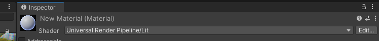
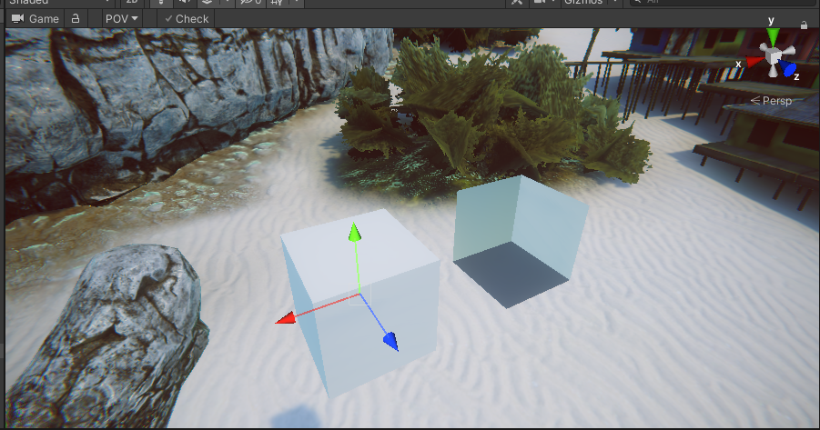
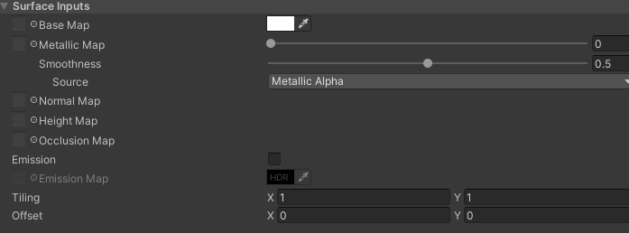
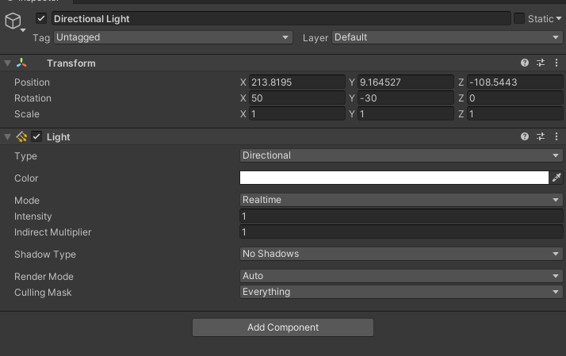
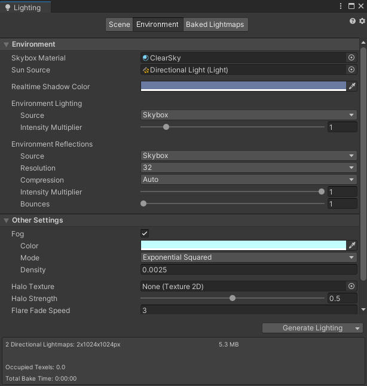

### Unity PBR光照调整参考

#### 材质选择

+ 新建材质，shader选择为 **Universal Render Pipeline/Lit**

  

#### 参数调整

+ **Surface Options**

  
  + **Workflow Mode**: 

    + **Metallic**: 标准的pbr光照，有Mettalic Map，金属材质完美呈现
    + **Specular**: 非标准pbr光照，高光不是公式计算得出，而是由提供的Specular Map呈现

    一般选Metallic模式，除非有特殊需求

  + **Surface Type:**

    + **Opaque**：不透明物体的渲染，墙壁，木头等选择该模式
    + Transparent：透明物体的渲染，玻璃，特效等选择该模式

  + **Render Face:**

    + **Front:** 朝向相机的三角面参与渲染
    + **Back:** 背对相机的面参与渲染
    + **Both:** 都参与渲染，开销比较大，一般不开启

    

  + **Alpha Clipping**

    通常用于复杂结构的渲染，如树叶等。Threshold参数调整稀疏成都。**一定要慎重开启，有比较大的性能开销问题。判断是否开启的最简单方法是看开启前后物体表现是否有差异，根据差异决定是否开启。**

  + **Receive Shadows：** 接受阴影，一般开启

+ **Surface Inputs：**

  
  + **Base Map:** Diffuse贴图
  + **Metallic Map:** 金属度贴图，用来衡量物体的金属度
    + **Smoothness：**
      + **Source：** 粗糙度贴图，不由单独的贴图提供，一般存储在Metallic图的alpha通道或者Base贴图的Alpha通道中。
      + **Smoothness参数：** **如果有smoothness贴图，那么贴图里面所有的smoothness值都会乘上这个参数。如果没有，这个参数作为默认的smoothness。新创建材质时，默认值是0.5，一定要调整这个参数**
  + **Normal Map:** 模型的Normal Map
  + **Height Map：** 一般不会用到，默认置空即可
  + **Occlusion Map:**  PBR光照的AO图
  + **Emission:** 材质会自发光时开启，如果不需要保持关闭。
  + **Tiling：** 调整上面所有贴图的平铺
  + **Offset：** 调整上面所有贴图的偏移

+ **Detail Inputs：**

  

  为模型额外赋予一张法线贴图，适用于模型特别大（比如山体），贴图大小有限制，通常会通过一张额外的贴图赋予细节，可指定Base和Normal图，暂时不会用到

+ **Advanced: **
  + **Specular Highlights**: 高光加强，默认开启即可
  + **Environment Reflections**: 环境高光，对光滑度比较高或者金属度比较高的物体影响比较明显，默认开启即可
  + **Enable GPU Instancing**：渲染参数，不要动
  + **Priority**：调整渲染次序，不要动

#### 环境光照：

+ **直接光照，方向光**

  创建方式：Create->Light->Directional，**保持场景中只有一个方向光**

  

  + **Type:** 一定要Directional
  + **Color：** 光照颜色
  + **Mode：** 选择Mix模式
  + **Intensity：** 光的强度
  + **Indirect Multiplier:** 每次反射后，光的衰弱系数，间接光相关
  + **Shadow Type: ** 该光源产生的阴影类型，Soft Shadow效果好，开销大，Hard Shadow则相反。一般是Soft Shadow。
  + RenderMode和CullingMask不要动

+ **间接光照：天空盒**

  Window-> Rendering-> Lighting

  
  + **Skybox Material：** 指定天空盒材质

  + **Sun Source：** 场景里面的方向光

  + **Environment Lighting：**

    + **Source：** 选Skybox即可。
    + **Intensity Multiplier: 天空盒上间接光的强度，关键参数，按需调整**

    调整的是场景中间接漫反射光部分

  + **Environment Reflection**：

    **只需要关注Intensity Multiplier参数：调整间接高光的强度**

  + **雾效调整**。

  **光照调整完毕后，一定要点击 Generate Lighting，更新场景中的间接光照，然后将结果上传。**