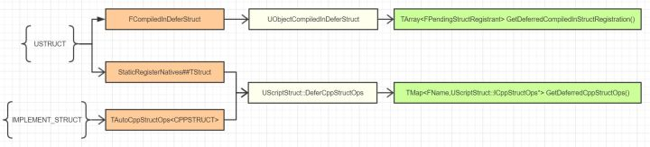

## 反射

**类型系统**是object之外的类型信息构建，**反射**描述的是运行时得到类型信息的功能，通过类型信息反过来创建对象，读取修改属性，调用方法的功能行为。反射更多的是一种行为能力，更偏向动词。类型系统值得是在程序运行空间内构建出来的类型信息。用代码声明出来的类型，可以通过一种数据结构完整描述出来，并在运行出来得到。

### C++ RTTI

c++运行时类型系统疲弱。c++运行时的RTTI的两种基本操作符：

1. typeid：可看作是编译器提供的一个唯一类型id，用于对比类型，判断从属于不同类型。
2. dynamic cast

#### C++反射方案：

1. 宏：手动标记注册各个类，方法，数据。繁琐，打破了常规写法

   ```c++
   struct Test
   {
       Declare_Struct(Test);
       Define_Field(1, int, a);
       Define_Field(2, int, b);
       Define_Metadata(3);
   }
   ```

2. 模板：详见rttr (TODO 学习这个库的用法)

3. 编译器数据分析。利用编译器的类型信息数据。依赖平台和编译器种类

4. 工具生成代码：用工具分析c++代码文件，然后用预定义好的规则生成相应的c++代码来对应源文件。Qt 的moc （meta object compiler）。

   UE的UHT：在c++源文件中用空的宏做标记，然后用UHT分析生成generated.h/cpp文件，然后编译。用这种方法能够对c++代码做比较小的修改，只是在代码里加了一些空的标记，并没有破坏原来类声明的结构。缺点是分析复杂语法费力。


## 类型系统设定和结构

在UE中，我们可以通过给类，枚举，属性，函数等加上特定的宏来标记更多的元数据。在有必要的时候这些标记宏甚至也可以安插进生成的代码来合成编译。

1. 根据宏生成代码而不是数据文件可以避免一致性。因为反射数据和引擎其他代码一起编译。
2. 标记分析哪个文件：UHE解析后会对应生成某个文件的.generated.h 或者.generated.cpp文件，所以原文件会include *.generated.h，就把这个include当成了标记需要分析的文件。

#### 类型信息的存储结构


##### 声明部分

+ 聚合类型（UStruct):
  + UFunction: 只可包含属性作为函数的输入输出参数
  + UScriptStruct：只可包含属性，可看作c++中的POD struct。UE中的轻量UOBject，支持反射，序列化，复制。但不受GC控制，需要自己控制内存分配释放。
  + UClass: 可包含属性和函数，most common
  
  聚合类型同一起来，形成了UStruct基类，可以把一些通用的添加属性等方法放在里面，同时实现继承。注意：c++中的USTRUCT宏生成的类型数据是用UScriptStruct表示的。
  
+ 原子类型：
  + Enum：支持普通枚举和enum class
  + int， Fstring等基础类型。可通过不同的UProperty支持。

UInterface：比较特殊，可以继承多个接口。跟c++中虚类一样，但在ue中接口只可以包含函数。如果要**定义个接口类，需要继承于UInterface，生成的类型数据依然用UClass存储。**UClass里面有TArray<FImplementedInterface> Interface数组，其子项又包含UClass *Class来支持查询当前类实现了哪些接口。

UProperty: 可看作是用一个类型定义个字段“type instance”。UProperty通过模板实例化特别多的子类如UBoolProperty。

UMetaData:是一个TMap<FName, FString>的键值对，用于为编辑器提供分类，友好名字，提示等信息，最终发布不会包含此信息。

##### UFiled存在意义

+ 统一所有的类型数据，方便存储遍历。
+ UProperty，UStruct，UEnum都可附加一份UMetaData，可放在基类里保存。
+ 方便添加一些额外的方法。UField里加上接口，子类里重载实现。

在对象上，可以用Instance->GetClass()来获得UClass对象，在UClass本身上调用GetClass()返回的是自己本身，用来区分对象和类型数据。

## 类型系统代码生成

UHT分析得到了足够的类型元数据信息后，利用这个信息在程序内存中构建起类型系统结构，这个过程是被称作**注册**。这些过程分为：生成，收集，注册，链接。在生成阶段，UHT分析代码，并生成类型系统的相关代码。具体代码生成略。

### 类型系统代码注册

根据c++ static对象会在main函数之前初始化的特性，可以设计出一种static自动注册模型。新增加注册条目是，只需要include相应的.h.cpp文件，就可以自动在程序启动main函数前自动执行一些操作。也可以把自动注册的声明变量声明进MyClass的一个静态成员变量。这种模式只能在独立的地址空间才能生效，如果该文件被静态链接且没有引用到可能会绕过static初始化。

#### UE的自动注册代码：

```c++
template <typename TClass>
struct TClassCompiledInDefer : public FFieldCompiledInInfo
{
	TClassCompiledInDefer(const TCHAR* InName, SIZE_T InClassSize, uint32 InCrc)
	: FFieldCompiledInInfo(InClassSize, InCrc)
	{
		UClassCompiledInDefer(this, InName, InClassSize, InCrc);
	}
	virtual UClass* Register() const override
	{
		return TClass::StaticClass();
	}
};

static TClassCompiledInDefer<TClass> AutoInitialize##TClass(TEXT(#TClass), sizeof(TClass), TClassCrc); 

//second method
```

```c++
struct FCompiledInDefer
{
	FCompiledInDefer(class UClass *(*InRegister)(), class UClass *(*InStaticClass)(), const TCHAR* Name, bool bDynamic, const TCHAR* DynamicPackageName = nullptr, const TCHAR* DynamicPathName = nullptr, void (*InInitSearchableValues)(TMap<FName, FName>&) = nullptr)
	{
		if (bDynamic)
		{
			GetConvertedDynamicPackageNameToTypeName().Add(FName(DynamicPackageName), FName(Name));
		}
		UObjectCompiledInDefer(InRegister, InStaticClass, Name, bDynamic, DynamicPathName, InInitSearchableValues);
	}
};
static FCompiledInDefer Z_CompiledInDefer_UClass_UMyClass(Z_Construct_UClass_UMyClass, &UMyClass::StaticClass, TEXT("UMyClass"), false, nullptr, nullptr, nullptr);
```

前者调用了UClassCompiledInDefer来手机类名字，类大小和CRC信息，把自己的指针保存进来以便后续调用Register方法。而UObjectCompiledInDefer最重要的收集的信息就是第一个用于构造UClass*对象的函数指针回调。

引擎中会触发Class信息收集的有 **UCLASS，UINTERFACE，IMPLEMENT_INTRINSIC_CLASS， IMPLEMENT_CORE_INTRINSIC_CLASS**。**IMPLEMENT_INTRIINSIC_CLASS** 用于代码中包装UModel，IMPLEMENT_CORE_INTRINSIC_CLASS则是用于包装UFiled，UClass等引擎内建类。


##### 使用TClassCompiledInDefer和FCompiledInDefer两个类等级的原因

TClassCompiledInDefer主要是为后续提供一个调用TClass::StaticClass的Register方法，该方法会触发GetPrivateStaticClassBody的调用，进而创建UClass*对象。FCompiledInDefer是在UClass *对象上继续调用构造函数，初始化属性和函数等的注册操作。即两个步骤：分配内存，然后再内存上构造对象。

##### UEnum的收集


##### UStruct的收集：



##### Function收集：

+ IMPLEMENT_CAST_FUNCTION:定义一些Object的转换函数。
+ IMPLEMENT_VM_FUNCTION:定义一些蓝图虚拟机使用的函数。


##### 使用延迟注册的原因

ue里面类很多，如果都在static阶段进行类的收集注册会很慢，表现为main函数很久才能执行。

##### 生成代码清晰高效的途径：

让代码变得简洁的手段都是在提升信息密度。提升信息密度的手段只有一个：同样的信息不要书写两遍，所用的方法就是封装，封装的手段有：

1. 宏。宏一直是代码拼接的最强利器。ue生成代码中用了ARRAYCOUNT， VTABLEOFFSET，IMPLEMENT_CLASS等。会降低可读性和可调式性。
2. 函数：相似逻辑封装成函数。
3. 模板
4. 

### 类型系统注册

##### NoExportTypes.h

这个文件里面重复定义了一些Enum，Struct, UObject，其目的就是为了把CoreUObject模块里的一些基础类型喂给UHT来生成类型的元数据信息。

```c++
UClass* UMyClass::GetPrivateStaticClass(const TCHAR* Package)
{
    static UClass* PrivateStaticClass = NULL;   //静态变量，下回访问就不用再去查找了
    if (!PrivateStaticClass)
    {
        /* this could be handled with templates, but we want it external to avoid code bloat */
        GetPrivateStaticClassBody(
            Package,    //包名,TEXT("/Script/Hello")，用来把本UClass*构造在该UPackage里
            (TCHAR*)TEXT("UMyClass") + 1 + ((StaticClassFlags & CLASS_Deprecated) ? 11 : 0),//类名，+1去掉U、A、F前缀，+11去掉Deprecated_前缀
            PrivateStaticClass, //输出引用，所以值会被改变
            StaticRegisterNativesUMyClass,  //注册类Native函数的指针
            sizeof(UMyClass),   //类大小
            alignof(UMyClass),
            UMyClass::StaticClassFlags, //类标记，值为CLASS_Intrinsic，表示在C++代码里定义的类
            UMyClass::StaticClassCastFlags(),   //虽然是调用，但只是简单返回值CASTCLASS_None
            UMyClass::StaticConfigName(),   //配置文件名，用于从config里读取值
            (UClass::ClassConstructorType)InternalConstructor<UMyClass>,//构造函数指针，包了一层
            (UClass::ClassVTableHelperCtorCallerType)InternalVTableHelperCtorCaller<UMyClass>,//hotreload的时候使用来构造虚函数表，暂时不管
            &UMyClass::AddReferencedObjects,   //GC使用的添加额外引用对象的静态函数指针，若没有定义，则会调用到UObject::AddReferencedObjects，默认函数体为空。
            &UMyClass::Super::StaticClass,  //获取基类UClass*的函数指针，这里Super是UObject
            &UMyClass::WithinClass::StaticClass //获取对象外部类UClass*的函数指针，默认是UObject
        );
    }
    return PrivateStaticClass;
}

void GetPrivateStaticClassBody(
    const TCHAR* PackageName,
    const TCHAR* Name,
    UClass*& ReturnClass,
    void(*RegisterNativeFunc)(),
    uint32 InSize,
    EClassFlags InClassFlags,
    EClassCastFlags InClassCastFlags,
    const TCHAR* InConfigName,
    UClass::ClassConstructorType InClassConstructor,
    UClass::ClassVTableHelperCtorCallerType InClassVTableHelperCtorCaller,
    UClass::ClassAddReferencedObjectsType InClassAddReferencedObjects,
    UClass::StaticClassFunctionType InSuperClassFn,
    UClass::StaticClassFunctionType InWithinClassFn,
    bool bIsDynamic /*= false*/
    )
{
    ReturnClass = (UClass*)GUObjectAllocator.AllocateUObject(sizeof(UClass), alignof(UClass), true);//分配内存
    ReturnClass = ::new (ReturnClass)UClass //用placement new在内存上手动调用构造函数
    (
    EC_StaticConstructor,Name,InSize,InClassFlags,InClassCastFlags,InConfigName,
    EObjectFlags(RF_Public | RF_Standalone | RF_Transient | RF_MarkAsNative | RF_MarkAsRootSet),
    InClassConstructor,InClassVTableHelperCtorCaller,InClassAddReferencedObjects
    );
    InitializePrivateStaticClass(InSuperClassFn(),ReturnClass,InWithinClassFn(),PackageName,Name);//初始化UClass*对象
    RegisterNativeFunc();//注册Native函数到UClass中去
}
```

GetPrivateStaticClassBody用全局内存分配器分配内存，然后调用UClass的构造函数。EC_StaticConstructor只是个标记用来指定调用特定的构造函数。InitializePrivateStaicClass会触发Super::StaticClass 和WithinClass::StaticClass调用。**InitializePrivateStaticClass** 会调用UObjectBase::Register的方法，记录信息到全局单例Map和一个全局链表里。

#### Register只是先记录下信息

static初始化的时候，UObject对象分配索引的机制还没有初始化完毕，如果这时候去创建各种UProperty，UFunction和UPackage不合适，创建出来也没有合适的地方保存索引。最开始的时候只能先简单创建UClass *对象，记录UClass *对象的创建，后续调用InitUObject继续初始化。继续构造的操作是在ProcessNewlyLoadedUobjects里面的。

在UObjectBase注册的时候，记录信息分别用了一个TMap加一个链表。原因有：

+ 方便快速查找，字典类可以做到O(1)的查找。
+ 链表来保证顺序注册

#### RegisterNativeFunc

该函数向UClass*里添加Native函数。这个时候UClass对象已经创建出来了，所以就直接保存到NativeFunctionLooupTable里面去了。对于非Native的函数，UHT自动生成一个函数体，在c++调用的时候，会触发查找。

##### 第一个UClass对象：

第一个UClass对象是UObject的Class*，其本身也是一个UObject对象。另一个对象表示了对象的类型，其本身也是个对象。类型系统的第一个类型是UObject类型。

### 类型系统注册：CoreUObject加载


类的注册流程

Winmain --> GuardedMain --> EnginePreInit --> FEngineLoop::PreInit --> LoadCoreModules -->FModuleManager::Get().LoadModule(TEXT("CoreUObject")) -> FCoreUObjectModule::StartupModule --> UClassRegisterAllCompiledInClasses在UClassRegisterAllCompiledInClasses函数内部，会调用所有通过TClassCompiledInDefer<TClass>注册的类，其方法Register会调用注册的类的TClass::StaticClass函数，进而创建出UClass对象并调用UObjectBase的Register。

对之前收集到的所有的xxx.gen.cpp里面定义的类，都触发其UClass的构造。UObject比较特殊，会在Static初始化的时候就触发构造。UClassRegisterAllCompiledInClasses可能会被调用多次，StartupModule最先调用，后续的ProcessNewlyLoadedUObject也会触发。

##### Struct和Enum的注册

模块里面定义的结构和枚举没有参与此阶段的注册。因为结构在注册后生成的元数据信息保存的对象时UScriptStruct，枚举对应的是UEnum，类对应的是UClass。除了在Native编译进来的UClass，其他UObject的构造都得有其UClass的辅助，因为UClass里面保存了累的构造函数指针。所以如果想构造出来UScriptStruct和UEnum对象，就必须有描述这两个类的元数据信息的UClass。而这两个名为ScriptStruct和Enum的UClass在上述的CoreUObject模块加载完成了。这个阶段其实是加载了所有的基本类型，因为类型就是用UClass描述的。

### 类型系统注册-InitUObject

FEngineLoop::PreInit --> FEngineLoop::AppInit

```
bool FEngineLoop::AppInit()
{
    //...做一些其他程序入口的初始化工作
    FCoreDelegates::OnInit.Broadcast(); //在前文注册的委托，在CoreUOject模块加载的时候指向了InitUObject
    return true;
}

void InitUObject()
{
    //...
    FCoreDelegates::OnExit.AddStatic(StaticExit);   //注册退出的事件
    //注册模块加载的
    FModuleManager::Get().OnProcessLoadedObjectsCallback().AddStatic(ProcessNewlyLoadedUObjects);
    //...
    StaticUObjectInit();//调用另一个函数
}
```

UE的组织形式是Module，一个Module编译后可以生成一个dll。dll是可以动态加载的。引擎初始化结束后，继续动态加载一个模块，此时会触发dll里面的static变量的初始化。收集到一些新的元数据信息。需要利用这些元数据信息来为这个新dll里定义的类构造类型的UClass*对象。ProcessNewlyLoadUobjects会在模块加载完后，给dll里面的native类构造类型对象。

```c++
void StaticUObjectInit()
{
    UObjectBaseInit();  //继续转发
    //最后，创建临时包
    GObjTransientPkg = NewObject<UPackage>(nullptr, TEXT("/Engine/Transient"), RF_Transient);
    GObjTransientPkg->AddToRoot();  //这个临时包总不会释放
    //...
}
template <class T>
struct NewObject
{
	T* operator()() const {return new T;}
};
```

UObjectBaseInit初始化结束后，可以NewObject了，标志着UObject系统的成功创建。GObjTransientPkg是全局变量，没有Outer的对象都会放在这个包里。

```c++
void UObjectBaseInit()
{
    //...
    GUObjectAllocator.AllocatePermanentObjectPool(SizeOfPermanentObjectPool);//初始化对象分配器
    GUObjectArray.AllocateObjectPool(MaxUObjects, MaxObjectsNotConsideredByGC, bPreAllocateUObjectArray);//初始化对象管理数组

    void InitAsyncThread();
    InitAsyncThread();  //初始化Package(uasset)的异步加载线程

    Internal::GObjInitialized = true;   //指定UObject系统初始化完毕

    UObjectProcessRegistrants();    //处理注册项
    //...
}
```

该函数主要作用：

+ 初始化UObject内存分配存储系统和对象的hash系统。
+ 创建异步加载线程
+ 设定GObjInitialized值，改值用于判断对象系统是否可用
+ 转发到UobjectProcessRegistrants把注册项意义处理。

```c++
static void UObjectProcessRegistrants()
{
    TArray<FPendingRegistrant> PendingRegistrants;
    DequeuePendingAutoRegistrants(PendingRegistrants);  //从链表中提取注册项列表

    for(int32 RegistrantIndex = 0;RegistrantIndex < PendingRegistrants.Num();++RegistrantIndex)
    {
        const FPendingRegistrant& PendingRegistrant = PendingRegistrants[RegistrantIndex];
        UObjectForceRegistration(PendingRegistrant.Object); //真正的注册
        DequeuePendingAutoRegistrants(PendingRegistrants);  //继续尝试提取
    }
}
```

注册每一项之后，都要重复调用DequeuePendingAutoRegisterants来提取一下。因为真正注册一个UObject的时候，可能触发另一个Module的加载，从而导致有新的注册项进来。

```c++
void UObjectForceRegistration(UObjectBase* Object)
{
    TMap<UObjectBase*, FPendingRegistrantInfo>& PendingRegistrants = FPendingRegistrantInfo::GetMap();//得到对象的注册信息
    FPendingRegistrantInfo* Info = PendingRegistrants.Find(Object);
    if (Info)   //有可能为空，因为之前已经被注册过了
    {
        const TCHAR* PackageName = Info->PackageName;//对象所在的Package
        const TCHAR* Name = Info->Name; //对象名字
        PendingRegistrants.Remove(Object);//删除
        Object->DeferredRegister(UClass::StaticClass(),PackageName,Name);//延迟注册
    }
}
```

UObjectForceRegistration可能调用地方：

+ UObjectProcessRegistrants里对一个个对象手动进行注册。
+ UClass::CreateDefaultObject内部用UObjectForceRegistration(ParentClass)来确认基类已经注册完成
+ UE4CodeGen_Private::ConstructUClass等构造类型对象的函数里用UObjectForceRegistration()来保证对象已经注册

所以重复调用的时候，需要先判断PendingRegistrants还存在该元素。

```c++
void UObjectBase::DeferredRegister(UClass *UClassStaticClass,const TCHAR* PackageName,const TCHAR* InName)
{
    // Set object properties.
    UPackage* Package = CreatePackage(nullptr, PackageName);    //创建属于的Package
    Package->SetPackageFlags(PKG_CompiledIn);
    OuterPrivate = Package; //设定Outer到该Package

    ClassPrivate = UClassStaticClass;   //设定属于的UClass*类型

    // Add to the global object table.
    AddObject(FName(InName), EInternalObjectFlags::None);   //注册该对象的名字
}
void UObjectBase::AddObject(FName InName, EInternalObjectFlags InSetInternalFlags)
{
    NamePrivate = InName;   //设定对象的名字
    //...
    //AllocateUObjectIndexForCurrentThread(this);
    //HashObject(this);
}
```

DeferredRegster才是真正对象注册的地方。

+ 区别于之前的UObjectBase::Register，延迟的意思是在对象系统初始化(GUObjectAllocator和GUobjectArray)之后的注册。Register的时候还不能正常NewObjecct和加载Package。
+ Register注册是对代码里的class生成相应的UClass*对象并添加到全局对象数组里。

这里所做的是创建出UClass*的Outer指向的Package，并设置ClassPrivate，在AddObject里设置NamePrivate，UClass *对象才有名字。到这一步没有UProperty和UFunction

##### FooEngineLoop::AppInit总结：

AppInit阶段里跟UObject有关的InitUObject操作：

1. ProcessNewlyLoadedUObjects回调的注册：让后续模块加载后可以调用该函数。
2. 对象存储分配系统初始化：GUObjectAllocator和GUObjectArray初始化
3. UObjectProcessRegistrants里对每一项进行注册，创建Package，设置OuterPrivate，ClassPrivate，NamePrivate，并添加到全局对象数组里。
4. 创建GObjTransientPkg临时包来存放以后的其他对象。

#### SuperStruct图示：


#### ClassPrivate:


### 类型系统构造-再次触发

#### ProcessNewlyLoadedObjects

```c++
void ProcessNewlyLoadedUObjects()
{
    UClassRegisterAllCompiledInClasses();   //为代码里定义的那些类生成UClass*
    //提取收集到的注册项信息
    const TArray<UClass* (*)()>& DeferredCompiledInRegistration=GetDeferredCompiledInRegistration();
    const TArray<FPendingStructRegistrant>& DeferredCompiledInStructRegistration=GetDeferredCompiledInStructRegistration();
    const TArray<FPendingEnumRegistrant>& DeferredCompiledInEnumRegistration=GetDeferredCompiledInEnumRegistration();
    //有待注册项就继续循环注册
    bool bNewUObjects = false;
    while (GFirstPendingRegistrant || 
    DeferredCompiledInRegistration.Num() || 
    DeferredCompiledInStructRegistration.Num() || 
    DeferredCompiledInEnumRegistration.Num())
    {
        bNewUObjects = true;
        UObjectProcessRegistrants();    //注册UClass*
        UObjectLoadAllCompiledInStructs();  //为代码里的枚举和结构构造类型对象
        UObjectLoadAllCompiledInDefaultProperties();    //为代码里的类继续构造UClass对象
    }

    if (bNewUObjects && !GIsInitialLoad)
    {
        UClass::AssembleReferenceTokenStreams();    //构造引用记号流，为后续GC用
    }
}
```

#### UObjectLoadAllCompiledInStructs

```c++
static void UObjectLoadAllCompiledInStructs()
{
    TArray<FPendingEnumRegistrant> PendingEnumRegistrants = MoveTemp(GetDeferredCompiledInEnumRegistration());
    for (const FPendingEnumRegistrant& EnumRegistrant : PendingEnumRegistrants)
    {
        CreatePackage(nullptr, EnumRegistrant.PackageName); //创建其所属于的Package
    }

    TArray<FPendingStructRegistrant> PendingStructRegistrants = MoveTemp(GetDeferredCompiledInStructRegistration());
    for (const FPendingStructRegistrant& StructRegistrant : PendingStructRegistrants)
    {
        CreatePackage(nullptr, StructRegistrant.PackageName);   //创建其所属于的Package
    }

    for (const FPendingEnumRegistrant& EnumRegistrant : PendingEnumRegistrants)
    {
        EnumRegistrant.RegisterFn();    //调用生成代码里Z_Construct_UEnum_Hello_EMyEnum
    }
    for (const FPendingStructRegistrant& StructRegistrant : PendingStructRegistrants)
    {
        StructRegistrant.RegisterFn(); //调用生成代码里Z_Construct_UScriptStruct_FMyStruct
    }
}
```

先enum再struct的调用其注册函数RegisterFn(). RegisterFn是个函数指针，指向生成代码里面的Z_Construct开头的函数，用来真正的构造出UEnum和UScriptStruct对象。

#### UObjectLoadAllCompiledInDefaultProperties

```c++
static void UObjectLoadAllCompiledInDefaultProperties()
{
    static FName LongEnginePackageName(TEXT("/Script/Engine")); //引擎包的名字
    if(GetDeferredCompiledInRegistration().Num() <= 0) return;
    TArray<UClass*> NewClassesInCoreUObject;
    TArray<UClass*> NewClassesInEngine;
    TArray<UClass*> NewClasses;
    TArray<UClass* (*)()> PendingRegistrants = MoveTemp(GetDeferredCompiledInRegistration());
    for (UClass* (*Registrant)() : PendingRegistrants) 
    {
        UClass* Class = Registrant();//调用生成代码里的Z_Construct_UClass_UMyClass创建UClass*
        //按照所属于的Package分到3个数组里
        if (Class->GetOutermost()->GetFName() == GLongCoreUObjectPackageName)
        {
            NewClassesInCoreUObject.Add(Class);
        }
        else if (Class->GetOutermost()->GetFName() == LongEnginePackageName)
        {
            NewClassesInEngine.Add(Class);
        }
        else
        {
            NewClasses.Add(Class);
        }
    }
    //分别构造CDO对象
    for (UClass* Class : NewClassesInCoreUObject)   { Class->GetDefaultObject(); }
    for (UClass* Class : NewClassesInEngine)        { Class->GetDefaultObject(); }
    for (UClass* Class : NewClasses)                { Class->GetDefaultObject(); }
}
```

依次调用RegsiterFn()来继续构造UClass*，这个函数指向了生成代码里的Z_Construct_UClass_UMyClass的函数。将生成的UClass对象，根据所属Package划分到3个数组里面。

总的构造流程图：


### 类型系统构造-构造绑定链接

##### UEnum：

```c++
void ConstructUEnum(UEnum*& OutEnum, const FEnumParams& Params)
	{
		UObject* (*OuterFunc)() = Params.OuterFunc;

		UObject* Outer = OuterFunc ? OuterFunc() : nullptr;

		if (OutEnum)
		{
			return;
		}

		UEnum* NewEnum = new (EC_InternalUseOnlyConstructor, Outer, UTF8_TO_TCHAR(Params.NameUTF8), Params.ObjectFlags) UEnum(FObjectInitializer());
		OutEnum = NewEnum;

		TArray<TPair<FName, int64>> EnumNames;
		EnumNames.Reserve(Params.NumEnumerators);
		for (const FEnumeratorParam* Enumerator = Params.EnumeratorParams, *EnumeratorEnd = Enumerator + Params.NumEnumerators; Enumerator != EnumeratorEnd; ++Enumerator)
		{
			EnumNames.Emplace(UTF8_TO_TCHAR(Enumerator->NameUTF8), Enumerator->Value);
		}

		NewEnum->SetEnums(EnumNames, (UEnum::ECppForm)Params.CppForm, Params.DynamicType == EDynamicType::NotDynamic);
		NewEnum->CppType = UTF8_TO_TCHAR(Params.CppTypeUTF8);

		if (Params.DisplayNameFunc)
		{
			NewEnum->SetEnumDisplayNameFn(Params.DisplayNameFunc);
		}

#if WITH_METADATA
		AddMetaData(NewEnum, Params.MetaDataArray, Params.NumMetaData);
#endif
	}

// operator new
inline void* operator new(const size_t InSize, EInternal InInternalOnly, UObject* InOuter = (UObject*)GetTransientPackage(), FName InName = NAME_None, EObjectFlags InSetFlags = RF_NoFlags) 
{ 
    return StaticAllocateObject(StaticClass(), InOuter, InName, InSetFlags); 
} 
```

UEnum构造时，源码里用了从在new的方式（用的不是placement new），new的定义方式在DECLARE_CLASS宏当中。先调用StaticAllocateObject来分配出一块对象内存，接着调用UEnum构造函数，构造完毕后填充枚举对象。

#### UScriptStruct

```c++
void ConstructUScriptStruct(UScriptStruct*& OutStruct, const FStructParams& Params)
{
    UObject* Outer = Params.OuterFunc ? Params.OuterFunc() : nullptr;//构造Outer
    UScriptStruct* Super = Params.SuperFunc ? Params.SuperFunc() : nullptr;//构造SuperStruct
    UScriptStruct::ICppStructOps* StructOps = Params.StructOpsFunc ? Params.StructOpsFunc() : nullptr;//构造结构操作类

    if (OutStruct) {return;}
    //构造UScriptStruct
    UScriptStruct* NewStruct = new(EC_InternalUseOnlyConstructor, Outer, UTF8_TO_TCHAR(Params.NameUTF8), Params.ObjectFlags) UScriptStruct(FObjectInitializer(), Super, StructOps, (EStructFlags)Params.StructFlags, Params.SizeOf, Params.AlignOf);
    OutStruct = NewStruct;
    //构造属性集合
    ConstructUProperties(NewStruct, Params.PropertyArray, Params.NumProperties);
    //链接
    NewStruct->StaticLink();
}
```

构造方式基本与UEnum流程相同。多了一步调用PrepareCppStructOps的操作，主要是从CppStructOps提出特征然后存在StructFlags里面。

##### ICppStructOps作用：

ICppStructOps类及其模板子类TCppStructOps<CPPSTRUCT>实现了c++的一种常见的架构模式，用一个虚函数基类定义一些公共操作，在用一个具体模板子类实现，从而既可以保存类型，又可以有公共操作接口。

针对UE4来说，ICppStructOps就定义了这个结构的一些公共操作，而探测这个c++结构的一些特性就交给了TCppStructOps<CPPSTRUCT>类里的TStructOpsTypeTraits<CPPSTRUCT>。一些c++结构的信息不能通过模板探测出来，就需要手动提供标记了。

#### UClass

暂时忽略

#### Bind

构造完个类型对象后，还需要完成一些后初始化工作。跟c++的编译机制类似，最后一步都是链接，通过符号定位到函数地址来替换。绑定的作用是把函数指针绑定到正确的地址。Bind是定义在UField里的方法，一般只有UFunction和UClass才有这两个操作。

UFunction::Bind()的目的是把FNativeFuncPtr Func绑定到正确的函数指针里去。

UClass的Bind在编译蓝图和载入Package里的类才需要调用，因为native的类在之前的GetPrivateStaticClassBody的时候已经传进去了函数指针。

#### 总结

UClass的构造阶段：

1. 内存构造。刚创建出来的一块白纸般的内存，只是简单调用了UClass的构造函数。UE里一个对象的构造，构造函数的调用只是起点。
2. 注册。给自己一个名字，把自己登记在对象系统中。通过DeferredRegister而不是Register完成的。
3. 对象构造。想对象里填充属性，函数，接口和元数据信息。这些是通过gen.cpp里面的函数完成的。
4. 绑定链接。整理属性和函数，优化下存储结构，为以后的使用提供更高的性能和便利。
5. CDO创建。有了类型后，每个UClass都会有一个CDO（class default object），有了CDO，相当于有了一个存档备份和参照。
6. 引用记号流构建。一个Class是怎么样有可能引用其他别的对象的，这颗引用树怎么构建高效，也是GC中一个非常重要的话题。有了引用记号流，就可以对一个对象高翔的分析它引用了多少对象。

### 反射应用实例：

##### 获取类型对象

```c++
TArray<UObject*> result;
//获取所有的class和Interface
GetObjectOfClass(UClass::StaticClass(), result);
// 获取所有的enum
GetObjectOfClass(UEnum::StaticClass(), result);
// 获取所有的struct
GetObjectOfClass(UScriptStruct::StaticClass(), result);
```

精确的根据一个名字来查找某个类型对象：

```c++
template<class T>
inline T* FindObject(UObject* outer, const TCHAR* Name, bool ExactClass=false);

UClass* classObj = FindObject<UClass>(ANY_PACKAGE, "MyClass");
```

##### 遍历字段：

获取了一个类型对象后，就可以用各种方式去遍历查找内部的字段了。UE4中提供了 **TFiledIterator<T>**.

```c++
const UStruct *structClass;
// 属性遍历
for(TFiledIterator<UProperty> i(structClass); i; ++i)
{
    UProperty* prop = *i;
}
// 函数遍历
for(TFiledIterator<UFunction> i(func);i;++i)
{
    UFunction* func = *i;
    for(TFiledIterator<UProperty> i(func);i;++i)
    {
        UProperty* param = *i;
        if(param->PropertyFlags & CPF_ReturnParm)
        {
            
        }
    }
}
// 遍历接口， for UClass
const UClass* classObj;
for(const FImplementedInterface &ii; classObj->Interafaces)
{
    UClass* interfaceClass = ii.Class;
}
//
UProperty* UStruct::FindPropertyByName(FName InName)const;
UFunction* UClass::FindFunctionByName(FName InName, EIncludeSuperFlag::Type IncludeSuper);
```

##### 获取设置属性值：

```c++
// 函数原型
template<typename ValueType>
	FORCEINLINE ValueType* ContainerPtrToValuePtr(UObject* ContainerPtr, int32 ArrayIndex = 0) const
	{
		return (ValueType*)ContainerUObjectPtrToValuePtrInternal(ContainerPtr, ArrayIndex);
	}
	template<typename ValueType>
	FORCEINLINE ValueType* ContainerPtrToValuePtr(void* ContainerPtr, int32 ArrayIndex = 0) const
	{
		return (ValueType*)ContainerVoidPtrToValuePtrInternal(ContainerPtr, ArrayIndex);
	}

FORCEINLINE void* ContainerVoidPtrToValuePtrInternal(void* ContainerPtr, int32 ArrayIndex) const
	{
		check(ArrayIndex < ArrayDim);
		check(ContainerPtr);

		if (0)
		{
			// in the future, these checks will be tested if the property is NOT relative to a UClass
			check(!Cast<UClass>(GetOuter())); // Check we are _not_ calling this on a direct child property of a UClass, you should pass in a UObject* in that case
		}

		return (uint8*)ContainerPtr + Offset_Internal + ElementSize * ArrayIndex;
	}

// 获取对象或结构里的属性值地址,看需转换成自己类型
void* PropertyValuePt = property->ConstainerptrToValuePtr<void*>(object);
```

##### 反射调用函数：

```c++
//方法原型
int32 UMyClass::Func(float param1);

UFUNCTION(BlueprintCallable)
int32 InvokeFunction(UObject* obj, FName functionName, float param1)
{
    struct MyClass_Func_Parms
    {
        float param1;
        int32 ReturnValue;
    }
    
    UFunction* func = obj->FindFunctionChecked(functionName);
    MyClass_Func_Parms params;
    params.param1 = param1;
    obj->ProcessEvent(func, &prams);
    return params.ReturnValue;
}

//使用：
int r = InvokeFunction(obj, "Func", 123.0f);

// 其他底层调用方法
FFrame frame(nullptr, func, &params, nullptr, func->Children);
obj->CallFunction(frame, &params + func->ReturnValueOffset, func);

FFrame frame(nullptr, func, &params, nullptr, func->Children);
func->Invoke(obj, frame, &params + func->ReturnValueOffset);
```

一个封装的方法：

```c++
template<typename... TReturns, typename... TArgs>
void InvokeFunction(UClass* objClass, UObject* obj, UFunction* func, TTuple<TReturns...>& outParams, TArgs&&... args)
{
    objClass = obj != nullptr ? obj->GetClass() : objClass;
    UObject* context = obj != nullptr ? obj : objClass;
    uint8* outPramsBuffer = (uint8*)&outParams;

    if (func->HasAnyFunctionFlags(FUNC_Native)) //quick path for c++ functions
    {
        TTuple<TArgs..., TReturns...> params(Forward<TArgs>(args)..., TReturns()...);
        context->ProcessEvent(func, &params);
        //copy back out params
        for (TFieldIterator<UProperty> i(func); i; ++i)
        {
            UProperty* prop = *i;
            if (prop->PropertyFlags & CPF_OutParm)
            {
                void* propBuffer = prop->ContainerPtrToValuePtr<void*>(&params);
                prop->CopyCompleteValue(outPramsBuffer, propBuffer);
                outPramsBuffer += prop->GetSize();
            }
        }
        return;
    }

    TTuple<TArgs...> inParams(Forward<TArgs>(args)...);
    void* funcPramsBuffer = (uint8*)FMemory_Alloca(func->ParmsSize);
    uint8* inPramsBuffer = (uint8*)&inParams;

    for (TFieldIterator<UProperty> i(func); i; ++i)
    {
        UProperty* prop = *i;
        if (prop->GetFName().ToString().StartsWith("__"))
        {
            //ignore private param like __WolrdContext of function in blueprint funcion library
            continue;
        }
        void* propBuffer = prop->ContainerPtrToValuePtr<void*>(funcPramsBuffer);
        if (prop->PropertyFlags & CPF_OutParm)
        {
            prop->CopyCompleteValue(propBuffer, outPramsBuffer);
            outPramsBuffer += prop->GetSize();
        }
        else if (prop->PropertyFlags & CPF_Parm)
        {
            prop->CopyCompleteValue(propBuffer, inPramsBuffer);
            inPramsBuffer += prop->GetSize();
        }
    }

    context->ProcessEvent(func, funcPramsBuffer);   //call function
    outPramsBuffer = (uint8*)&outParams;    //reset to begin

    //copy back out params
    for (TFieldIterator<UProperty> i(func); i; ++i)
    {
        UProperty* prop = *i;
        if (prop->PropertyFlags & CPF_OutParm)
        {
            void* propBuffer = prop->ContainerPtrToValuePtr<void*>(funcPramsBuffer);
            prop->CopyCompleteValue(outPramsBuffer, propBuffer);
            outPramsBuffer += prop->GetSize();
        }
    }
}
```

