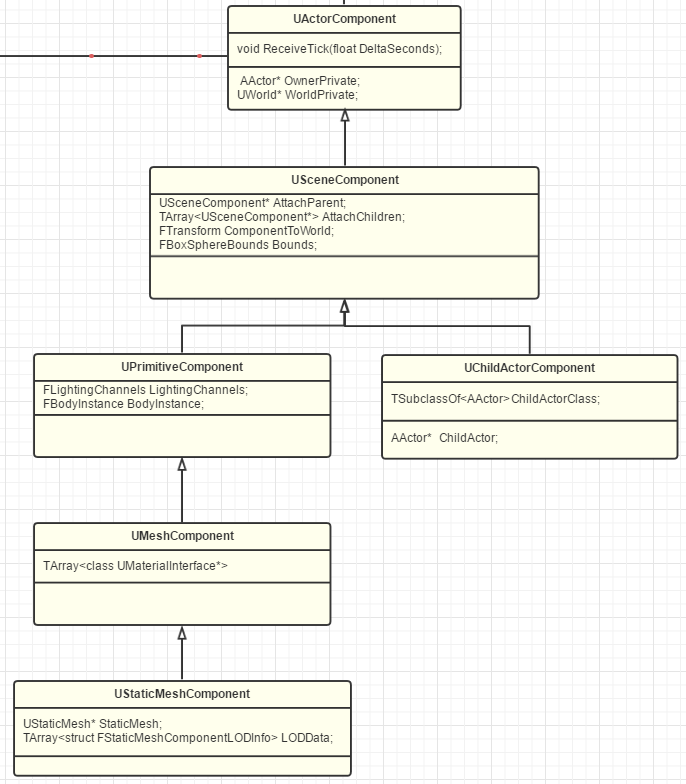
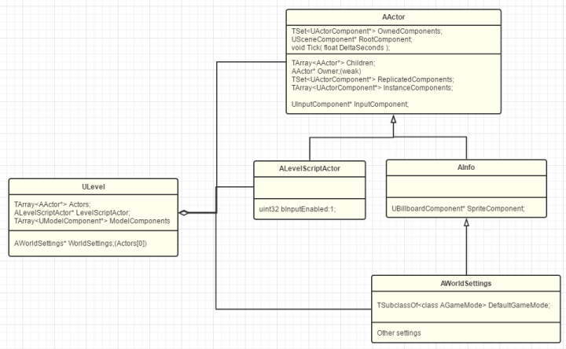
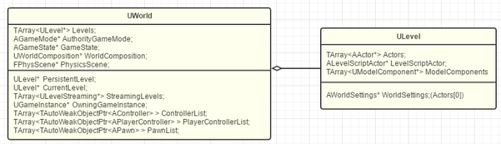
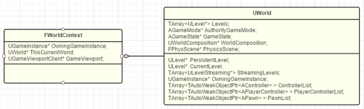
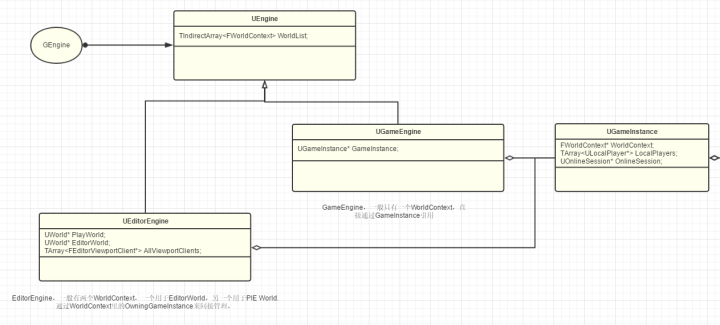

##### 基础

1. 材质编辑器的可视化节点就是各种函数。材质编辑器会生成ShaderTemplate和完整的shader。ShaderTemplate 是个函数库。当材质编译时，会调用每个节点的compile函数，将可视化节点的HLSL代码压入ShaderTemplate中。ShaderTemplate的框架在**MaterialTemplate.ush**文件中。**FHLSLMaterialTranslator**执行填充过程

##### 编译系统

+ UnrealBuildTool (UBT, c#): ue自定义工具，来编译UE4的逐个模块并处理依赖。
+ UnrealHeaderTool (UHT, c++): C++代码解析生成工具。如宏UCLass和#include "*.generated.h"都为UHT提供信息来生成相应的c++反射代码。

### Actor和Component

+ UObject: 所有类的基类。提供元数据，反射生成，GC，序列化，编辑器可见。

+ Actor：继承自UObject。有Replication，Spawn，Tick等方法。Actor不带Transform。Actor是世界中的种种元素（地上的石头，整个世界的运行规则等）。所以不带Transform。

+ Component: Actor的组件，实现各种功能。继承关系：

  

  SceneComponent作用：Transform和SceneComponent相互嵌套。ActorComponent这一层不能相互嵌套。UE里，只有带Transform的SceneComponent才能嵌套。

+ 父子关系的确定

  Actor之间的父子关系通过Component来确定。Actor是一个容器，只提供基本的创建销毁，网络复制，事件触发等。父子关系的维护交给了component。

### Level and World:

#### Level

继承自UObject。**ALevelScriptActor**可以通过actor名称取得本关卡的actor。**AWorldSettings**一一记录着本level的各种规则属性。如果level是PersistentLevel，就会被当做整个world的设置。AWorldSetting放在关卡Actors首位是为了方便网络复制。

##### World

Persistent level一开始就会加载进world，streaming是后续加载的意思。Levels里面保存所有当前已加载的level。StreamingLevels保存整个World的Levels配置列表。

Level是actor的容器，同时划分了World，支持了Level的动态加载。切换场景或者关卡就是在这个World中加载释放不同的level。

### 

### WorldContext, GameInstance, Engine

+ **FWorldContext**:保存着**ThisCurrentWorld**指向当前的world。当需要从当前World切换到另个World的时候，FWorldContext保存切换过程信息和目标World上下文信息。游戏中，只有一个WorldContext。

+ GameInstance:保存着当前的WorldContext和其他整个游戏的信息。他是游戏引擎中Game的概念，是能直接接触到的最根源的操作类。

+ **Engine**: UEngine的两个子类：UGameEngine（游戏用）和UEditorEngine（编辑器用）。

  

总体架构：Object->Actor+Component->Level->World->WorldContext->GameInstance->Engine.